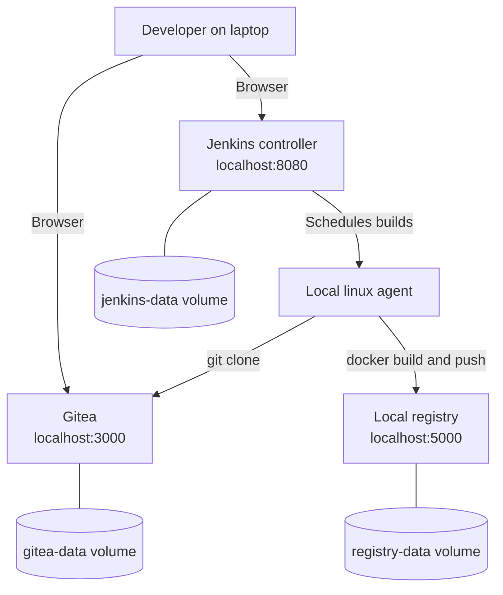
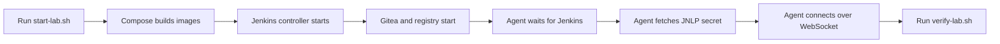

# 00 - Local Lab Setup

This module creates a complete local Jenkins learning lab using Docker Compose. It is the fastest way to start learning because it gives you Jenkins, a real build agent, Gitea, and a local Docker registry on one laptop.

## Module Summary

| Field | Value |
| --- | --- |
| Level | Beginner |
| Estimated duration | 30-45 minutes |
| Required environment | Docker Engine or Docker Desktop with Compose v2 |
| Cost | Free |
| Validation | `./scripts/verify-lab.sh` |
| Cleanup | `./scripts/stop-lab.sh` or `./scripts/reset-lab.sh --yes` |

## Learning Objectives

- Understand the controller-agent Jenkins model
- Start a local CI/CD lab with repeatable scripts
- Verify that builds run on a `linux` agent instead of on the controller
- Connect Jenkins to Gitea and a local Docker registry
- Understand the convenience and risk of Docker socket mounting

## What This Lab Deploys

- Jenkins controller
- One inbound Jenkins agent with label `linux`
- Gitea for source control
- Docker Registry v2
- Shared Docker network
- Persistent volumes for Jenkins, Gitea, and registry data

## Architecture

Mermaid source: [diagrams/local-lab-architecture.mmd](./diagrams/local-lab-architecture.mmd)



The controller coordinates work. The agent executes builds. In simple language: Jenkins is the manager, the agent is the worker.

## Prerequisites

```bash
docker version
docker compose version
```

Recommended host resources:

- 4 GB RAM available to Docker
- 10 GB free disk space
- Ports `8080`, `3000`, `5000`, and `50000` available

Check ports:

```bash
ss -tln | grep -E ':(8080|3000|5000|50000)\\b' || true
```

PowerShell:

```powershell
Get-NetTCPConnection -State Listen | Where-Object { $_.LocalPort -in 8080,3000,5000,50000 }
```

## Security Note

This lab mounts `/var/run/docker.sock` into Jenkins and the agent so the agent can run `docker build` and `docker push` against your host Docker daemon. That keeps the setup short and beginner-friendly, but it is not a production-safe design.

Why it matters technically:

- any process with Docker socket access can usually control the host Docker daemon
- that can lead to container breakout or privileged host access

Why it matters in simple language:

- giving Jenkins Docker socket access is like giving it the keys to your Docker host

Safer production alternatives:

- dedicated remote agents
- Kubernetes ephemeral agents
- Kaniko
- BuildKit
- rootless builders
- isolated build nodes

## Startup

```bash
cp .env.example .env
./scripts/start-lab.sh
```

PowerShell:

```powershell
Copy-Item .env.example .env
./scripts/start-lab.ps1
```

## Expected Output

After startup:

- `http://localhost:8080` serves Jenkins
- `http://localhost:3000` serves Gitea
- `http://localhost:5000/v2/` returns `{}` or HTTP `200`
- Jenkins shows controller executors as `0`
- Jenkins shows agent `local-linux-agent` online with label `linux`

## Validation

Run:

```bash
./scripts/verify-lab.sh
```

The script checks:

- Docker Compose services are running
- Jenkins responds on `/login`
- Gitea responds on `/`
- registry responds on `/v2/`
- agent container is running
- Jenkins logs indicate the agent connected

## Lab Workflow

Mermaid source: [diagrams/local-lab-flow.mmd](./diagrams/local-lab-flow.mmd)



## Troubleshooting

Use:

```bash
./scripts/troubleshoot-lab.sh
```

Common issues:

- Port already in use
- Docker daemon not running
- Agent cannot connect because Jenkins is still starting
- Jenkins plugin installation failed during image build
- Gitea data volume contains old state from a previous run

## Stop, Reset, and Cleanup

Stop but keep data:

```bash
./scripts/stop-lab.sh
```

Destroy containers and volumes:

```bash
./scripts/reset-lab.sh --yes
```

## Directory Layout

```text
00-local-lab-setup/
├── README.md
├── docker-compose.yml
├── .env.example
├── jenkins/
│   ├── Dockerfile
│   ├── plugins.txt
│   └── jenkins.yaml
├── agent/
│   ├── Dockerfile
│   ├── entrypoint.sh
│   └── README.md
├── scripts/
│   ├── start-lab.sh
│   ├── start-lab.ps1
│   ├── stop-lab.sh
│   ├── stop-lab.ps1
│   ├── reset-lab.sh
│   ├── verify-lab.sh
│   └── troubleshoot-lab.sh
└── diagrams/
    ├── local-lab-architecture.mmd
    └── local-lab-flow.mmd
```

## Next Step

Continue to [Project 01 - Python Flask Todo API](../15-real-world-projects/01-python-flask-todo-api/README.md).
