# 01 — Jenkins Fundamentals

## Overview

This section covers the foundational concepts of Jenkins and Continuous Integration/Continuous Delivery (CI/CD). Before writing a single pipeline, every DevOps engineer must deeply understand what Jenkins is, why it exists, and how it works architecturally.

---

## Objectives

By the end of this section you will:

- Understand what Jenkins is and the problems it solves
- Understand CI/CD concepts at a foundational level
- Know the Jenkins architecture (controller, agents, executors)
- Understand the Jenkins build lifecycle
- Know key Jenkins terminology
- Understand how Jenkins fits in a modern DevOps toolchain

---

## Topics Covered

| # | Topic | Description |
|---|-------|-------------|
| 1 | What is Jenkins? | History, purpose, ecosystem |
| 2 | What is CI/CD? | Concepts, benefits, stages |
| 3 | Jenkins Architecture | Controller, agents, executors |
| 4 | Jenkins Build Lifecycle | Stages of a build |
| 5 | Key Terminology | Glossary of Jenkins terms |
| 6 | Jenkins vs Alternatives | Comparison with GitHub Actions, GitLab CI, etc. |
| 7 | DevOps & CI/CD Philosophy | Where Jenkins fits |

---

## What is Jenkins?

Jenkins is an **open-source automation server** written in Java. It is one of the most widely adopted CI/CD tools in the world, with over 300,000 active installations globally.

Jenkins was originally created as **Hudson** at Sun Microsystems in 2004 by Kohsuke Kawaguchi. After Oracle acquired Sun, the community forked Hudson and renamed it Jenkins in 2011. It is now maintained by the Jenkins community under the Linux Foundation's Continuous Delivery Foundation (CDF).

### What Problems Does Jenkins Solve?

Without CI/CD automation:

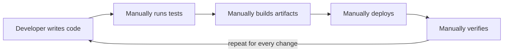

With Jenkins:

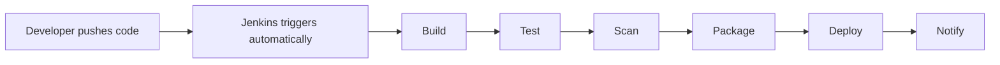

Jenkins solves:

- **Integration Hell** — frequent, automated merges prevent large-scale conflicts
- **Slow feedback loops** — developers know within minutes if their code broke something
- **Manual error-prone deployments** — automation replaces repetitive human steps
- **Lack of visibility** — centralized pipeline visibility and history
- **Inconsistent environments** — pipelines enforce consistent build and deploy processes

---

## Introduction to CI/CD (Start Here)

If you are brand new, read this before the formal definitions below. No
jargon — just the idea.

### CI/CD in one sentence

> **CI/CD is a robot assistant that automatically checks, assembles, and
> ships your software every time you change the code — so humans stop doing
> the slow, boring, mistake-prone parts by hand.**

That is the whole concept. Everything else is detail.

### The problem it solves: "integration day"

Imagine five people writing one book. For a month, each writes their own
chapters alone, never comparing notes. On the last day, they try to staple
all the chapters into a single book.

Chaos. Chapter 3 refers to a character Chapter 7 already killed off. Two
people wrote the same scene differently. The page numbers don't line up.
Fixing it takes longer than the writing did.

That painful "last day" is exactly what software teams used to call
**integration day** — everyone merging a month of code at once and spending
days untangling the conflicts.

**Continuous Integration** says: *don't wait for the last day.* Merge your
work into the shared book **many times a day**, and have a robot re-read the
whole book after every change to catch contradictions immediately — while
they are tiny and easy to fix.

**Continuous Delivery / Deployment** extends the same idea to shipping:
*don't save releases for a scary "release weekend."* Keep the software
always ready to publish, and let the robot push it out safely, in small
steps, any day of the week.

### The two halves, in plain language

| Term | What it means | Everyday analogy |
|------|---------------|------------------|
| **CI** — Continuous Integration | Every code change is automatically merged, built, and tested right away | A spell-checker that re-checks the whole document the instant you type |
| **CD** — Continuous Delivery | Every change that passes is automatically prepared and staged, ready to release with one click | A finished parcel, packed and addressed, waiting by the door for you to say "send" |
| **CD** — Continuous Deployment | Same as above, but the parcel is sent automatically — no human click | The parcel ships itself the moment it's packed |

> The two "CD"s share initials on purpose. **Delivery** keeps a human
> approval button before production; **Deployment** removes even that button.
> Delivery is "ready to ship anytime"; Deployment is "ships itself."

### The pipeline: think of a factory conveyor belt

CI/CD runs your code along an automated **conveyor belt**. Your change hops
on at one end; if it survives every station, working software rolls off the
other end. If it fails any station, the belt stops and tells you exactly
which station rejected it.

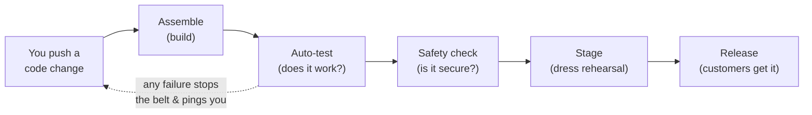

### Real-world examples

- **Amazon** deploys a code change to production roughly **every 11.7
  seconds** on average across its teams. That is only possible because
  robots — not humans — run the checks and the release. No team could click
  "deploy" that often by hand.
- **Netflix** pushes thousands of changes a day. When your recommendations
  quietly improve overnight, a CI/CD pipeline shipped that change while you
  slept, tested it on a slice of users, and kept it only because the numbers
  looked good.
- **A two-person startup** uses the *same* idea at tiny scale: a developer
  pushes a fix at 2 p.m., a free pipeline builds and tests it in five
  minutes, and the bug fix is live for customers before the coffee is cold —
  with no "release process" meeting.
- **Your bank's mobile app** likely uses **Continuous Delivery** (not
  Deployment): every change is kept release-ready automatically, but a human
  still presses the button for production, because a bad payments bug is
  expensive. The robot does the work; a person keeps the final say.

### Why teams bother: the payoff

| Without CI/CD | With CI/CD |
|---------------|------------|
| "It works on my machine" 🤷 | It works on the robot's clean machine, so it works everywhere |
| Bugs found days later, by customers | Bugs caught in minutes, by the pipeline |
| Scary all-hands "release weekends" | Boring, boring releases — a non-event, any day |
| "Who broke the build? When?" | The pipeline names the exact change and person |
| Releases are rare, big, and risky | Releases are frequent, small, and safe |

The core shift CI/CD gives a team is going from **"I hope this works"** to
**"I know within minutes."** Jenkins, which the rest of this repo teaches, is
one of the most popular robots that runs this conveyor belt.

---

## What is CI/CD?

### Continuous Integration (CI)

**Continuous Integration** is the practice of frequently merging developer changes into a shared repository, where automated builds and tests verify each integration.

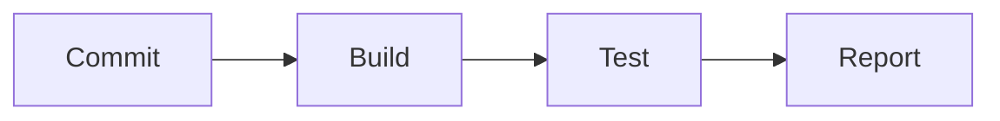

Key CI principles:

- Commit to mainline frequently (at least daily)
- Every commit triggers an automated build
- Build must be fast (< 10 minutes target)
- Tests must pass before merge
- Fix broken builds immediately — they are the team's top priority

### Continuous Delivery (CD)

**Continuous Delivery** extends CI by automatically deploying every successful build to a staging environment, keeping software always in a releasable state.

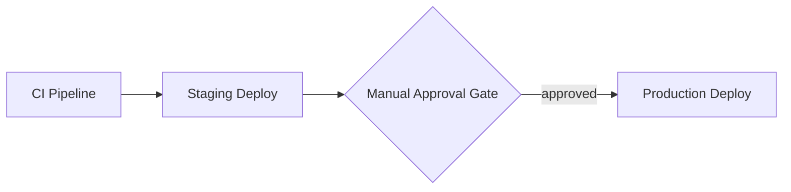

### Continuous Deployment

**Continuous Deployment** goes further — every successful build is automatically deployed to production with no manual gate.

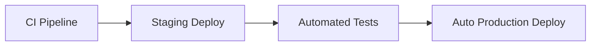

### CI/CD Pipeline Stages

```mermaid
flowchart LR
    A[Source Code] --> B[Build]
    B --> C[Unit Tests]
    C --> D[Code Analysis]
    D --> E[Integration Tests]
    E --> F[Security Scan]
    F --> G[Package/Publish]
    G --> H[Deploy to Dev]
    H --> I[Deploy to Staging]
    I --> J[Approval Gate]
    J --> K[Deploy to Production]
    K --> L[Monitoring]
```

---

## Jenkins Architecture

Understanding Jenkins architecture is critical for production deployments.

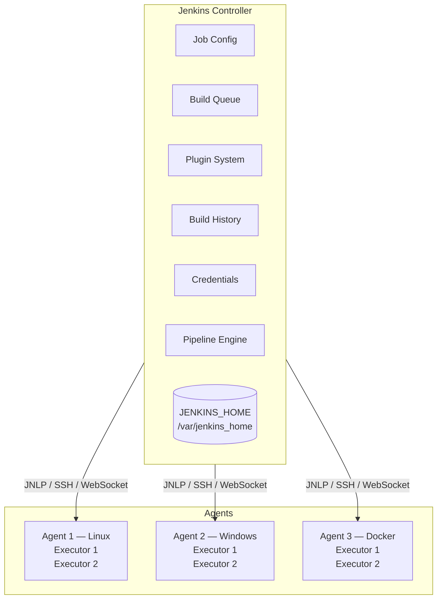

### Jenkins Controller (Master)

The **Jenkins Controller** is the central orchestration server. It:

- Stores all configuration (jobs, credentials, plugins)
- Schedules builds and assigns them to agents
- Manages the build queue
- Provides the web UI
- Stores build history and artifacts
- Runs the pipeline engine

> **Production Rule:** Never run builds on the controller. The controller should only orchestrate — all actual work runs on agents.

### Jenkins Agents (Nodes)

**Agents** (formerly called "slaves") are worker machines that execute build steps. They:

- Connect to the controller via SSH, JNLP, or WebSocket
- Execute the actual pipeline steps
- Can be static (permanent) or dynamic (ephemeral)
- Run one or more **executors** (concurrent build slots)

#### Agent Types

| Type | Description | Use Case |
|------|-------------|----------|
| Permanent Agent | Always-on VM or bare metal | Consistent workloads |
| Docker Agent | Container spun up per build | Isolated, reproducible builds |
| Kubernetes Agent | Pod spun up per build | Cloud-native, scalable |
| SSH Agent | Connect to remote machine via SSH | Legacy systems |
| JNLP Agent | Agent connects to controller | Agents behind firewalls |

### Executors

An **executor** is a slot for running one build at a time on an agent. An agent with 4 executors can run 4 concurrent builds.

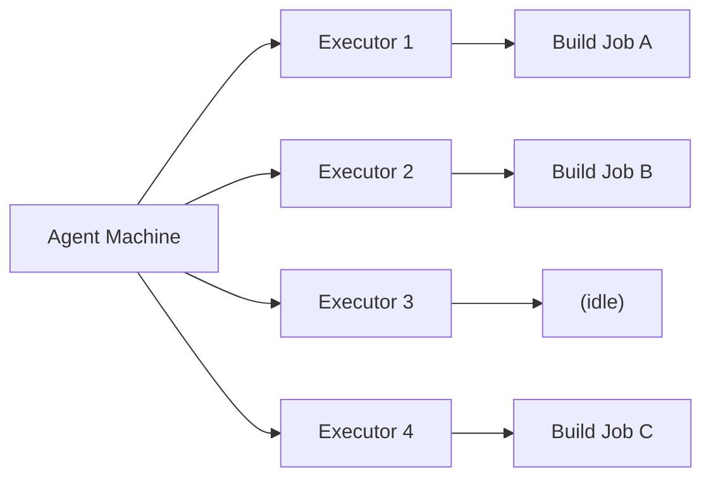

> **Tip:** Set executors equal to the number of CPU cores on the agent, minus one for OS overhead.

---

## Jenkins Build Lifecycle

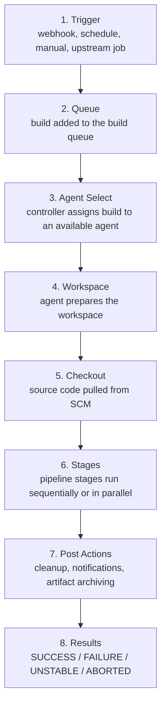

---

## Key Jenkins Terminology

The **Everyday analogy** column translates each term into plain language.
Think of Jenkins as an automated kitchen: recipes, cooks, and counters.

| Term | Definition | Everyday analogy |
|------|-----------|------------------|
| **Job** | A configured task that Jenkins can run | A recipe on file |
| **Build** | A single execution of a job | Cooking that recipe once |
| **Pipeline** | A scripted series of stages defining a CI/CD workflow | The full recipe, step by step |
| **Stage** | A logical grouping of steps within a pipeline | One course of the meal (prep, cook, plate) |
| **Step** | A single action within a stage | One instruction ("chop onions") |
| **Agent** | A machine that executes builds | A cook who does the actual work |
| **Executor** | A thread/slot on an agent for running builds | A burner the cook can use — 4 burners, 4 dishes at once |
| **Workspace** | A directory on the agent where build files live | The counter space for one dish |
| **Artifact** | A file produced by a build (JAR, Docker image, etc.) | The finished plate handed to the customer |
| **Upstream** | A job that triggers another job | The starter that signals the main course to begin |
| **Downstream** | A job triggered by another job | The main course that waits on the starter |
| **Trigger** | The event that starts a build | The order ticket coming in |
| **SCM** | Source Control Management (Git, SVN, etc.) | The pantry the ingredients (code) come from |
| **Plugin** | Extension that adds functionality to Jenkins | A specialty appliance added to the kitchen |
| **Credentials** | Securely stored secrets (passwords, tokens, keys) | The locked safe for the keys |
| **Node** | Any machine in the Jenkins cluster (controller or agent) | Anyone in the kitchen — head chef or cook |
| **Label** | A tag used to route builds to specific agents | "Grill station only" on an order ticket |
| **JCasC** | Jenkins Configuration as Code | Writing the kitchen rulebook as a file, not by memory |
| **Groovy** | The scripting language used in Jenkins pipelines | The language the recipes are written in |
| **DSL** | Domain-Specific Language used in Pipeline and Job DSL | A shorthand recipe notation |

---

## A Real-World Scenario: One Push, Ten Minutes Later

Meet Priya, a developer on a payments team. Here is what Jenkins does for
her on an ordinary Tuesday — and what it replaces.

**Before Jenkins (manual):**

1. Priya finishes a bug fix and pushes it.
1. She pings a teammate to please pull, build, and test it.
1. Someone runs the tests locally an hour later — they pass "on my machine."
1. On Friday, ten changes are merged at once; two conflict; a bad one ships
   to production over the weekend. Nobody is sure which change broke it.

**With Jenkins (automated):**

1. Priya pushes her fix. A **webhook** instantly **triggers** a **build**.
1. Jenkins checks out the code, runs unit tests, scans for secrets, builds a
   Docker **artifact**, and deploys it to a staging environment — all on an
   **agent**, in about eight minutes.
1. If anything fails, Jenkins posts the exact failing **stage** to Slack
   before Priya has finished her coffee. She fixes it while the context is
   fresh.
1. Because every change is integrated and tested the moment it lands,
   Friday's ten changes were already verified one at a time. No weekend
   surprise.

That shift — from "hope it works" to "know within minutes" — is the entire
point of CI/CD, and Jenkins is one of the most common engines that provides
it.

---

## Jenkins vs Alternatives

| Feature | Jenkins | GitHub Actions | GitLab CI | CircleCI | ArgoCD |
|---------|---------|---------------|-----------|----------|--------|
| Self-hosted | ✅ | Optional | Optional | Optional | ✅ |
| Cloud SaaS | ❌ | ✅ | ✅ | ✅ | ❌ |
| Free | ✅ (OSS) | ✅ (limited) | ✅ (limited) | ✅ (limited) | ✅ (OSS) |
| Plugin ecosystem | ✅ (1800+) | Growing | Growing | Limited | Limited |
| Pipeline as Code | ✅ | ✅ | ✅ | ✅ | ✅ |
| Kubernetes native | Via plugin | Partial | Partial | Partial | ✅ |
| Learning curve | High | Low | Medium | Low | Medium |
| Enterprise support | CloudBees | GitHub Enterprise | GitLab EE | Paid | Paid |
| Best for | Complex enterprise CI/CD | GitHub-native projects | GitLab users | Simple cloud CI | GitOps CD |

> **When to Choose Jenkins:**
>
> - You need deep customization and control
> - You have complex, multi-technology build requirements
> - You need to run entirely on-premises
> - Your organization already has Jenkins expertise
> - You need the extensive plugin ecosystem

---

## Where Jenkins Fits in a Modern DevOps Toolchain

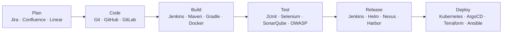

Jenkins sits at the **heart of the CI/CD pipeline**, orchestrating tools across every phase.

---

## Key Takeaways

1. Jenkins is a battle-tested, flexible automation server used by enterprises worldwide
2. CI/CD reduces integration risk and speeds up software delivery
3. Jenkins architecture separates orchestration (controller) from execution (agents)
4. Never run builds on the Jenkins controller in production
5. Jenkins is most powerful when combined with other DevOps tools
6. The learning curve is higher than SaaS alternatives, but the flexibility is unmatched

---

## References

- [Jenkins Official Documentation](https://www.jenkins.io/doc/)
- [Jenkins Architecture](https://www.jenkins.io/doc/book/managing/nodes/)
- [CI/CD Concepts — Atlassian](https://www.atlassian.com/continuous-delivery/principles/continuous-integration-vs-delivery-vs-deployment)
- [The DevOps Handbook](https://itrevolution.com/the-devops-handbook/)
- [Continuous Delivery — Jez Humble](https://continuousdelivery.com/)
- [CNCF CI/CD Landscape](https://landscape.cncf.io/card-mode?category=continuous-integration-delivery)

---

## Next Section

[02 — Installation →](../02-installation/README.md)
