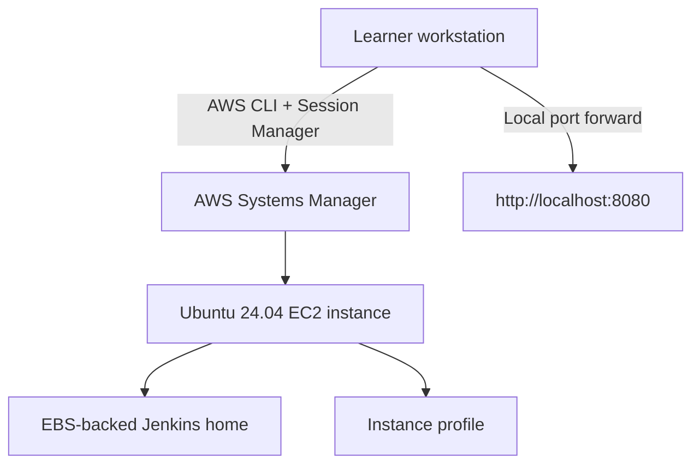

# 01 - Architecture and Prerequisites

## Architecture



Technical explanation:

- one EC2 instance hosts Jenkins and stores data on EBS-backed storage
- AWS Systems Manager Session Manager provides shell access and local port forwarding without public SSH

Simple explanation:

- your laptop talks to AWS, AWS opens a controlled session to the instance, and Jenkins stays private

## Recommended Sizing

- Instance size: `t3.large` or similar with at least 4 GB RAM
- Disk: approximately 50 GB
- Region: choose the region closest to your learners

## Required Tools

```bash
aws --version
session-manager-plugin --version
terraform version
```

## AWS Permissions Needed

- EC2 instance creation and deletion
- IAM role and instance profile creation
- Security group management
- VPC and subnet read access or creation access
- Systems Manager access

## Common Mistakes

- hardcoding an AMI ID that only exists in one region
- opening port `22` or `8080` to the whole internet
- forgetting to attach `AmazonSSMManagedInstanceCore`
- using stored long-lived AWS keys inside Jenkins

## Validation

```bash
./scripts/preflight.sh
```
