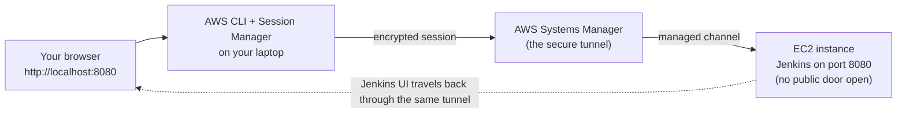

# 02 - Manual Console Deployment (with localhost access)

## Goal

Launch Jenkins by hand from the AWS Console — clicking every button
yourself — and then open the Jenkins web UI safely in your own browser at
`http://localhost:8080`, **without exposing Jenkins to the public internet**.

This is the "do it manually so you understand every piece" version of the
lab. The [Terraform path](./03-terraform-deployment.md) automates all of
this once you know what the clicks mean.

## Module Facts

| Field | Value |
| --- | --- |
| Level | Beginner |
| Estimated duration | 40-60 minutes |
| Prerequisites | An AWS account, [AWS CLI v2](https://docs.aws.amazon.com/cli/latest/userguide/getting-started-install.html), the [Session Manager plugin](https://docs.aws.amazon.com/systems-manager/latest/userguide/session-manager-working-with-install-plugin.html) |
| Cost | A `t3.large` runs roughly 0.08 USD/hour on-demand, plus about 50 GB of EBS storage (~4 USD/month). Stop or terminate the instance when done. |
| What you get | A private Jenkins server you reach through a secure tunnel |

Run the preflight check before you start:

```bash
./scripts/preflight.sh
```

---

## The Big Picture in Plain Language

Before the clicks, here is what each AWS piece actually is. If you are new
to the cloud, these analogies are enough to follow the whole lab.

| AWS thing | What it really is | Everyday analogy |
| --- | --- | --- |
| **EC2 instance** | A computer you rent by the hour in Amazon's data center | Renting a PC in someone else's building |
| **AMI** | The pre-installed operating system image the computer boots from | The Windows/Ubuntu install disc |
| **EBS volume** | The virtual hard drive attached to that computer | The disk where files live |
| **Security group** | A firewall listing who is allowed to connect | A bouncer with a guest list |
| **IAM role** | An identity badge the computer wears so AWS trusts it | A staff ID badge, no password to lose |
| **Systems Manager (SSM)** | A secure remote-control channel run by AWS | A locked service tunnel into the building |

The one idea that ties the lab together:

> Instead of opening a door to the internet (risky), we keep the building
> sealed and use AWS's own private tunnel to reach Jenkins. Your laptop
> pretends Jenkins is running locally, even though it lives on a server in
> the cloud.



---

## Why Learn the Manual Path

Real-world reasons teams still do this by hand:

- **Proof-of-concept / demo** — a team wants to try Jenkins for a week
  before committing to automation. One instance, spun up by hand, is the
  fastest way to show value.
- **Learning and interviews** — being able to explain *why* you attach an
  IAM role instead of storing AWS keys, or *why* port 8080 stays closed, is
  exactly what interviewers probe.
- **Locked-down environments** — in many companies, opening any inbound port
  requires a security review. SSM port forwarding sidesteps that entirely,
  which is why regulated teams (banks, healthcare) prefer it.
- **Break-glass / recovery** — when automation is broken, engineers fall
  back to the console. Knowing the manual steps is a survival skill.

---

## Part A — Launch the Instance from the Console

### Step 1 — Pick your region

In the top-right of the AWS Console, choose a region close to you (for
example `us-east-1`). Everything you create lives in that region.

> **Layman note:** a region is just *which city's data center* your rented
> computer sits in. Closer means lower latency.

### Step 2 — Start launching an instance

Go to **EC2 → Instances → Launch instances**. Give it a name such as
`jenkins-lab-manual`.

### Step 3 — Choose the operating system (AMI)

Select **Ubuntu Server 24.04 LTS** from the Canonical listing.

> **Why:** this lab's install script targets Ubuntu 24.04. Picking a
> different OS means the later commands may not match.

### Step 4 — Choose the size

Pick an instance type with **at least 4 GB RAM**, such as `t3.large`.

> **Layman note:** Jenkins plus Java is memory-hungry. A tiny `t2.micro`
> will technically boot but crawl or crash during a build. 4 GB is the
> comfortable floor.

### Step 5 — Key pair: choose "Proceed without a key pair"

You do **not** need an SSH key, because you will never SSH in. Access comes
through Systems Manager instead.

> **Why this is safer:** an SSH key is a secret that can leak. No key means
> nothing to steal, and no port 22 to attack.

### Step 6 — Network settings: keep everything closed

Click **Edit** on network settings and create a security group with **no
inbound rules at all** (or only the rules AWS forces). Specifically:

- do **not** add an SSH (22) rule open to `0.0.0.0/0`
- do **not** add a custom TCP (8080) rule open to `0.0.0.0/0`

> **Layman note:** you are telling the bouncer "let nobody in from the
> street." We will still get in — through the staff tunnel (SSM), not the
> front door.

### Step 7 — Attach an IAM role so SSM works

This is the step people forget. Expand **Advanced details → IAM instance
profile** and attach a role that includes the AWS-managed policy
**`AmazonSSMManagedInstanceCore`**.

If no such role exists yet, create one:

1. Open **IAM → Roles → Create role**.
1. Trusted entity type: **AWS service**, use case: **EC2**.
1. Attach policy **`AmazonSSMManagedInstanceCore`**
   (optionally **`CloudWatchAgentServerPolicy`** for logs).
1. Name it `jenkins-lab-ssm-role` and create it.
1. Back on the launch screen, select that role as the instance profile.

> **Why:** the IAM role is the instance's badge. Without
> `AmazonSSMManagedInstanceCore`, Systems Manager will not recognize the
> instance, and the tunnel in Part C will not exist.

### Step 8 — Storage

Set the root volume to **50 GB or larger** (gp3 is fine).

> **Why:** Jenkins stores build history, workspaces, and artifacts. The
> default 8 GB fills up fast.

### Step 9 — Install Jenkins automatically at boot (optional but recommended)

Expand **Advanced details → User data** and paste the contents of
[cloud-init/install-jenkins.sh](./cloud-init/install-jenkins.sh).

> **Layman note:** "user data" is a script AWS runs the first time the
> computer boots — like a setup wizard that installs Java and Jenkins for
> you so you do not have to type the commands yourself.

If you skip this, you will run the install by hand in Part B.

### Step 10 — Launch

Click **Launch instance**. After a minute or two:

- the instance shows **Running** in the EC2 console
- **Systems Manager → Fleet Manager** lists the instance as **Managed**
  (this is the signal that SSM and the IAM role are working)

> If the instance never appears as "Managed," the IAM role from Step 7 is
> almost always the cause.

---

## Part B — Install Jenkins (only if you skipped Step 9)

Open a shell **through SSM** (no SSH, no open ports):

```bash
aws ssm start-session --target <INSTANCE_ID>
```

Then, on the instance:

```bash
sudo bash /opt/ultimate-jenkins/install-jenkins.sh
sudo systemctl status jenkins --no-pager
java -version
curl -I http://localhost:8080/login
```

Expected: Jenkins is `active (running)` and `curl` returns HTTP `200` or
`403` (both mean "Jenkins is up").

> `<INSTANCE_ID>` looks like `i-0abc123def4567890`. Copy it from the EC2
> console or from `aws ec2 describe-instances`.

---

## Part C — Reach Jenkins at localhost:8080 (the key step)

Jenkins is running on the server's port 8080, but that port is closed to the
world. To use it, you forward it to your own laptop.

### Start the tunnel

From your laptop (not the instance):

```bash
aws ssm start-session \
  --target <INSTANCE_ID> \
  --document-name AWS-StartPortForwardingSession \
  --parameters '{"portNumber":["8080"],"localPortNumber":["8080"]}'
```

Or use the helper script in this module:

```bash
./scripts/start-port-forwarding.sh <INSTANCE_ID>
```

Leave that terminal open — it *is* the tunnel. Closing it closes the tunnel.

### Open your browser

Visit:

```text
http://localhost:8080
```

> **What just happened, in plain terms:** your laptop's port 8080 now acts
> as a private doorway. Anything you send to `localhost:8080` travels
> through the encrypted SSM tunnel to the server's port 8080 and back. To
> your browser it feels local; in reality Jenkins is in the cloud, and no
> stranger on the internet can reach it.

### Unlock Jenkins

In a second terminal, open an SSM shell and read the one-time password:

```bash
aws ssm start-session --target <INSTANCE_ID>
sudo cat /var/lib/jenkins/secrets/initialAdminPassword
```

Paste it into the browser, install the suggested plugins, create your admin
user, and continue in
[05-initial-jenkins-configuration.md](./05-initial-jenkins-configuration.md).

---

## Expected Output

- EC2 console shows the instance as **Running**
- Systems Manager shows it as **Managed**
- `curl -I http://localhost:8080/login` on the instance returns `200`/`403`
- With the tunnel running, `http://localhost:8080` loads the Jenkins setup
  page in your local browser

## Validation

```bash
./scripts/verify-instance.sh <INSTANCE_ID>
./scripts/verify-jenkins.sh
```

## Troubleshooting

| Symptom | Likely cause | Fix |
| --- | --- | --- |
| Instance not listed as "Managed" in SSM | IAM role missing `AmazonSSMManagedInstanceCore` | Attach the policy (Step 7) and reboot the instance |
| `start-session` fails with "not connected" | SSM agent still starting, or no outbound internet from the subnet | Wait 1-2 minutes; ensure the subnet can reach AWS endpoints |
| Browser shows "connection refused" at localhost:8080 | Tunnel terminal was closed, or Jenkins not up yet | Re-run the port-forward command; check `systemctl status jenkins` |
| `localPortNumber` 8080 already in use | Another app owns 8080 on your laptop | Forward to a different local port, e.g. `"localPortNumber":["8081"]`, then browse `localhost:8081` |
| Jenkins page loads but is very slow | Instance too small | Use `t3.large` or larger (Step 4) |

## Less Secure Fallback (use only if you must)

If Session Manager is genuinely unavailable during a live demo, you *may*
temporarily open Jenkins to **your own IP only**:

- add an inbound rule: TCP `8080` from `YOUR_PUBLIC_IP/32`

Never use `0.0.0.0/0`. Treat this as a temporary exception and delete the
rule during cleanup. The tunnel above is always the preferred path.

## Cleanup

To stop paying for the instance:

```bash
./scripts/cleanup-check.sh
```

Then in the console, **terminate** the instance (deletes it and its EBS
volume) or **stop** it (keeps the disk, pauses most charges). If you added
the fallback security-group rule, remove it now. See
[12-cleanup.md](./12-cleanup.md) for the full teardown.

---

## What You Learned

- An EC2 instance is a rented computer; an AMI is its OS; EBS is its disk.
- A security group is a firewall, and the safest inbound rule is *none*.
- An IAM role lets the instance prove its identity without stored keys.
- SSM port forwarding brings a private cloud service to `localhost` so you
  get convenient access with none of the exposure.

Next: [03-terraform-deployment.md](./03-terraform-deployment.md) automates
every click above into repeatable code.
