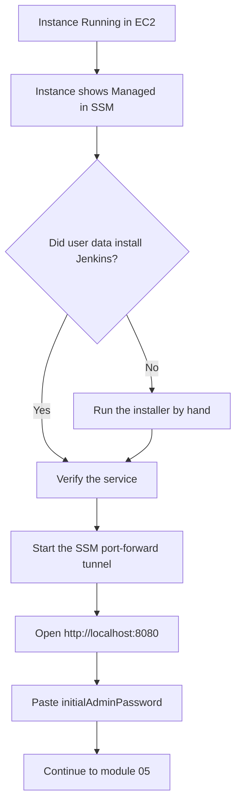

# 04 - Installing Jenkins (End to End)

This is the step-by-step path from **"my instance is running"** to **"Jenkins
is unlocked in my browser."** Follow it in order. Every step tells you what to
run, what you should see, and what to do when you see something else.

## Module Facts

| Field | Value |
| --- | --- |
| Level | Beginner |
| Estimated duration | 15-25 minutes (most of it waiting on `apt`) |
| Prerequisites | A running Ubuntu 24.04 instance from [02](./02-manual-console-deployment.md) or [03](./03-terraform-deployment.md), AWS CLI v2, Session Manager plugin |
| Cost | No new resources are created here |
| Expected result | `jenkins.service` is `active (running)` and the setup wizard loads at `http://localhost:8080` |

---

## The Sequence at a Glance



Steps 1-2 happen **on the instance** (through an SSM shell). Steps 3-5 happen
**on your laptop**. Mixing those up is the most common source of confusion.

---

## Step 1 — Get a shell on the instance

Grab the instance ID first. From Terraform:

```bash
cd 02-installation/aws-ec2-single-instance/terraform
terraform output -raw instance_id
```

Or, if you launched from the console:

```bash
aws ec2 describe-instances \
  --filters "Name=tag:Project,Values=ultimate-jenkins-devops" \
            "Name=instance-state-name,Values=running" \
  --query "Reservations[].Instances[].InstanceId" --output text
```

Then open a shell — no SSH key, no open ports:

```bash
aws ssm start-session --target <INSTANCE_ID>
```

**Expected:** a prompt like `sh-5.2$`. Run `sudo su - ubuntu` if you want a
friendlier shell.

**If it fails with `TargetNotConnected`:** the instance is not registered with
Systems Manager yet. Wait 2 minutes after boot, then check that the IAM role
carries `AmazonSSMManagedInstanceCore` and that the subnet has outbound
internet access. Nothing below will work until this step does.

---

## Step 2 — Check whether Jenkins actually installed

Run this on the instance:

```bash
systemctl status jenkins --no-pager
```

### Case A — `active (running)`

The bootstrap worked. Skip to Step 3.

### Case B — `Unit jenkins.service could not be found`

This is the error most people hit, and it means exactly one thing: **the user
data script never finished, so the Jenkins package was never installed.** The
service file ships inside the package, so a missing unit is a missing package,
not a broken service.

Confirm it and find out where the script died:

```bash
# Did cloud-init run user data at all, and did it succeed?
cloud-init status --long

# The bootstrap script's own log (present only if the script got started)
sudo tail -50 /var/log/jenkins-bootstrap.log

# Cloud-init's capture of user-data stdout/stderr — the authoritative log
sudo tail -80 /var/log/cloud-init-output.log

# Is the package there at all?
dpkg -l jenkins 2>/dev/null || echo "jenkins package NOT installed"
```

The three causes, in order of how often they bite:

| What you see in the log | Cause | Fix |
| --- | --- | --- |
| `Could not get lock /var/lib/dpkg/lock-frontend` | Ubuntu's `unattended-upgrades` timer held the apt lock during early boot. The old script had no lock timeout, so `set -e` aborted it before Jenkins installed. | Re-run the installer (below). The current script waits up to 10 minutes for the lock. |
| `Could not resolve 'pkg.jenkins.io'` / `Temporary failure resolving` | No outbound internet at boot — private subnet with no NAT gateway, or a restrictive egress rule. | Fix egress, then re-run the installer. |
| No `/var/log/cloud-init-output.log` mention of the script at all | User data was never pasted, or was pasted without the `#!/usr/bin/env bash` first line. Cloud-init silently ignores user data that has no shebang. | Re-run the installer by hand, and include the shebang next time. |

**Recovery — run the installer by hand.** If a previous boot staged it:

```bash
sudo bash /opt/ultimate-jenkins/install-jenkins.sh
```

If that file does not exist (the script died before staging itself), paste the
contents of [cloud-init/install-jenkins.sh](./cloud-init/install-jenkins.sh)
into a file on the instance and run it:

```bash
sudo tee /opt/install-jenkins.sh >/dev/null <<'EOF'
# paste the file contents here, then press Ctrl-D
EOF
sudo bash /opt/install-jenkins.sh
```

The script is safe to run repeatedly. It takes 3-6 minutes, and it streams
progress, so you can watch which stage is slow.

---

## Step 3 — Verify on the instance before you touch the browser

Still on the instance:

```bash
systemctl is-active jenkins
java -version
curl -I http://localhost:8080/login
sudo test -f /var/lib/jenkins/secrets/initialAdminPassword && echo "password file present"
```

**Expected output:**

- `systemctl is-active jenkins` prints `active`
- `java -version` reports `openjdk version "21.` …
- `curl -I` returns `HTTP/1.1 200 OK` or `403 Forbidden` — **both mean Jenkins
  is up**. A `403` here is normal, not a failure.
- `password file present`

**If `curl` says `Connection refused` but the service is active:** Jenkins is
still starting. It needs 30-90 seconds after the service starts. Watch it come
up with `sudo journalctl -u jenkins -f` and wait for
`Jenkins is fully up and running`.

**If the service is `activating` forever or keeps restarting:** almost always
memory. Check with `free -m`; Jenkins needs 4 GB. A `t3.micro` will loop here.
`sudo journalctl -u jenkins -n 50 --no-pager` shows the real error.

---

## Step 4 — Read the unlock password (still on the instance)

```bash
sudo cat /var/lib/jenkins/secrets/initialAdminPassword
```

Copy the 32-character hex string somewhere. You need it in Step 6. Then leave
this shell open, or exit — either is fine.

---

## Step 5 — Open the tunnel (on your laptop, new terminal)

Jenkins listens on the instance's port 8080, which is closed to the internet
by design. Forward it to your own machine:

```bash
aws ssm start-session \
  --target <INSTANCE_ID> \
  --document-name AWS-StartPortForwardingSession \
  --parameters '{"portNumber":["8080"],"localPortNumber":["8080"]}'
```

Or use the helper:

```bash
./scripts/start-port-forwarding.sh <INSTANCE_ID>
```

**Expected:** `Waiting for connections...` and the terminal stays open.

**This terminal *is* the tunnel.** Do not close it, do not Ctrl-C it. Open a
new terminal tab for anything else.

**If it says port 8080 is already in use on your laptop,** forward to a
different local port and use that in the browser:

```bash
--parameters '{"portNumber":["8080"],"localPortNumber":["8081"]}'
```

---

## Step 6 — Unlock Jenkins in the browser

Go to:

```text
http://localhost:8080
```

You should see **Unlock Jenkins**. Paste the password from Step 4, then:

1. Click **Install suggested plugins** and wait 3-5 minutes.
1. Create your first admin user — use a real password, not `admin`/`admin`.
1. Accept the Jenkins URL as `http://localhost:8080/`.
1. Click **Start using Jenkins**.

**If the browser shows "connection refused":** the tunnel terminal from Step 5
was closed, or Jenkins is not actually up — go back to Step 3.

**If the page loads but hangs on plugin installation:** the instance has no
outbound internet to `updates.jenkins.io`. Same fix as the DNS case in Step 2.

---

## Validation

From your laptop, with the tunnel running:

```bash
./scripts/verify-instance.sh <INSTANCE_ID>
./scripts/verify-jenkins.sh
```

Both should print `[pass]` lines. `verify-jenkins.sh` takes the local port as
an optional argument if you forwarded to 8081.

## What You Learned

- A missing `jenkins.service` unit means a missing **package**, not a broken
  service — always check `cloud-init-output.log` before debugging systemd.
- Early-boot `apt` contends with Ubuntu's own upgrade timers, so unattended
  installs need a lock timeout and retries.
- HTTP `403` from `/login` is a healthy Jenkins.
- The port-forward terminal is the tunnel; its lifetime is your access.

## Next Steps

Jenkins is running but wide open in configuration terms. Continue to
[05-initial-jenkins-configuration.md](./05-initial-jenkins-configuration.md)
to set up security, then
[06-first-freestyle-job.md](./06-first-freestyle-job.md) for your first build.

When you are done for the day, **stop or terminate the instance** —
see [12-cleanup.md](./12-cleanup.md).
