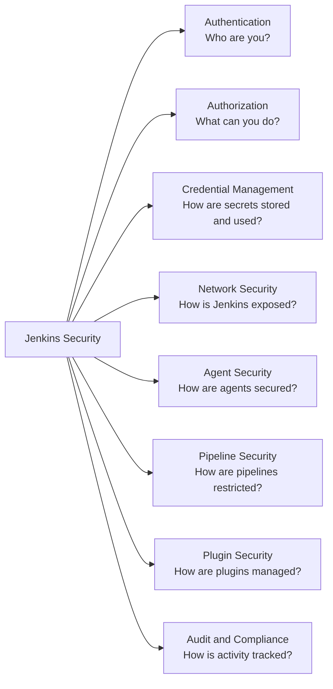

# 12 — Jenkins Security

## Overview

Security is not optional in a Jenkins production environment. Jenkins has access to your source code, secrets, and deployment infrastructure — making it a high-value target. This section covers comprehensive security hardening, from authentication and authorization to secret management, agent security, and pipeline security controls.

## Module Status

| Field | Value |
| --- | --- |
| Status | 🚧 In Progress |
| Practical references | [SECURITY.md](../SECURITY.md), [local lab](../00-local-lab-setup/README.md), [AWS EC2 lab](../02-installation/aws-ec2-single-instance/README.md) |
| Migration note | This module still needs a full learner-template migration with exercises and validations |

---

## Security Domains



---

## 1. Authentication

### LDAP / Active Directory (Enterprise)

```yaml
# JCasC: LDAP Authentication
jenkins:
  securityRealm:
    ldap:
      configurations:
      - server: ldap://ldap.example.com:389
        rootDN: dc=example,dc=com
        userSearchBase: ou=users,dc=example,dc=com
        userSearch: sAMAccountName={0}   # Active Directory
        groupSearchBase: ou=groups,dc=example,dc=com
        groupSearchFilter: (&(objectClass=group)(member={0}))
        managerDN: cn=jenkins-bind,ou=service-accounts,dc=example,dc=com
        managerPasswordSecret: ${LDAP_BIND_PASSWORD}
      disableMailAddressResolver: false
      displayNameAttributeName: displayName
      mailAddressAttributeName: mail
```

### SSO with SAML (Recommended for Large Orgs)

```yaml
# JCasC: SAML Authentication
jenkins:
  securityRealm:
    saml:
      idpMetadataConfiguration:
        xml: ${SAML_IDP_METADATA}
      displayNameAttributeName: displayName
      groupsAttributeName: groups
      usernameAttributeName: email
      emailAttributeName: email
      maximumAuthenticationLifetime: 28800   # 8 hours
```

### GitHub OAuth (Common for Open Source)

```yaml
jenkins:
  securityRealm:
    github:
      clientID: ${GITHUB_CLIENT_ID}
      clientSecret: ${GITHUB_CLIENT_SECRET}
      githubApiUri: https://api.github.com
      githubWebUri: https://github.com
      oauthScopes: "read:org,user:email,repo"
```

---

## 2. Authorization — Role-Based Access Control

### RBAC via JCasC

```yaml
jenkins:
  authorizationStrategy:
    roleBased:
      roles:
        global:
        # Full admin access
        - name: admin
          pattern: ".*"
          permissions:
          - "Overall/Administer"
          assignments:
          - "jenkins-admins"
          - "platform-team"

        # Developer: can build and view jobs
        - name: developer
          pattern: ".*"
          permissions:
          - "Overall/Read"
          - "Job/Build"
          - "Job/Cancel"
          - "Job/Read"
          - "Job/Workspace"
          - "View/Read"
          - "Run/Replay"
          assignments:
          - "jenkins-developers"
          - "engineering"

        # Viewer: read-only access
        - name: viewer
          pattern: ".*"
          permissions:
          - "Overall/Read"
          - "Job/Read"
          - "View/Read"
          assignments:
          - "jenkins-viewers"
          - "management"

        # Release manager: can deploy to production
        - name: release-manager
          pattern: ".*"
          permissions:
          - "Overall/Read"
          - "Job/Build"
          - "Job/Read"
          - "Run/Replay"
          assignments:
          - "release-managers"

        items:
        # Team-specific access patterns
        - name: team-alpha-full
          pattern: "team-alpha/.*"
          permissions:
          - "Job/Build"
          - "Job/Cancel"
          - "Job/Configure"
          - "Job/Create"
          - "Job/Delete"
          - "Job/Read"
          - "Job/Workspace"
          assignments:
          - "team-alpha"

        - name: team-beta-full
          pattern: "team-beta/.*"
          permissions:
          - "Job/Build"
          - "Job/Cancel"
          - "Job/Configure"
          - "Job/Create"
          - "Job/Delete"
          - "Job/Read"
          - "Job/Workspace"
          assignments:
          - "team-beta"
```

---

## 3. Credential Management

### Credential Types and Best Practices

```text
Secret Management Hierarchy:
  External Vault (HashiCorp Vault, AWS Secrets Manager)
      ↓ Dynamic secrets, rotation
  Jenkins Credentials Store (encrypted, in JENKINS_HOME)
      ↓ Static secrets, manual rotation
  Environment Variables (never in pipeline code)
```

### HashiCorp Vault Integration

```groovy
// Vault plugin — fetch secrets dynamically
stage('Deploy') {
    steps {
        withVault(
            configuration: [
                vaultUrl: 'https://vault.example.com',
                vaultCredentialId: 'vault-approle-credentials',
                engineVersion: 2
            ],
            vaultSecrets: [
                [
                    path: 'secret/production/database',
                    engineVersion: 2,
                    secretValues: [
                        [envVar: 'DB_USER', vaultKey: 'username'],
                        [envVar: 'DB_PASS', vaultKey: 'password'],
                        [envVar: 'DB_URL',  vaultKey: 'connection_string']
                    ]
                ],
                [
                    path: 'secret/production/api-keys',
                    engineVersion: 2,
                    secretValues: [
                        [envVar: 'STRIPE_KEY', vaultKey: 'stripe_secret_key'],
                        [envVar: 'SENDGRID_KEY', vaultKey: 'sendgrid_api_key']
                    ]
                ]
            ]
        ) {
            sh './deploy.sh'
        }
    }
}
```

### AWS Secrets Manager Integration

```groovy
stage('Fetch Secrets') {
    steps {
        script {
            withCredentials([[$class: 'AmazonWebServicesCredentialsBinding',
                              credentialsId: 'aws-credentials']]) {
                def secret = sh(
                    script: """
                        aws secretsmanager get-secret-value \
                          --secret-id production/my-app/database \
                          --region us-east-1 \
                          --query SecretString \
                          --output text
                    """,
                    returnStdout: true
                ).trim()

                def secretMap = readJSON text: secret
                env.DB_USER = secretMap.username
                env.DB_PASS = secretMap.password
            }
        }
    }
}
```

### Credential Masking

Jenkins automatically masks credential values in build logs. Verify this works:

```groovy
steps {
    withCredentials([string(credentialsId: 'my-secret', variable: 'SECRET')]) {
        // This will print: echo My secret is: ****
        sh 'echo "My secret is: ${SECRET}"'

        // NEVER do this — writes to env dump which may be logged
        // sh 'env | grep SECRET'
    }
}
```

---

## 4. Network Security

### TLS Configuration (Kubernetes Ingress)

```yaml
# jenkins-ingress.yaml
apiVersion: networking.k8s.io/v1
kind: Ingress
metadata:
  name: jenkins
  namespace: jenkins
  annotations:
    nginx.ingress.kubernetes.io/proxy-body-size: "50m"
    nginx.ingress.kubernetes.io/proxy-read-timeout: "600"
    nginx.ingress.kubernetes.io/proxy-send-timeout: "600"
    nginx.ingress.kubernetes.io/ssl-redirect: "true"
    nginx.ingress.kubernetes.io/force-ssl-redirect: "true"
    # Restrict access to VPN only
    nginx.ingress.kubernetes.io/whitelist-source-range: "10.0.0.0/8,172.16.0.0/12"
    cert-manager.io/cluster-issuer: letsencrypt-prod
    # Security headers
    nginx.ingress.kubernetes.io/configuration-snippet: |
      more_set_headers "X-Frame-Options: SAMEORIGIN";
      more_set_headers "X-Content-Type-Options: nosniff";
      more_set_headers "X-XSS-Protection: 1; mode=block";
      more_set_headers "Strict-Transport-Security: max-age=31536000; includeSubDomains";
      more_set_headers "Content-Security-Policy: default-src 'self'; script-src 'self' 'unsafe-inline' 'unsafe-eval'; style-src 'self' 'unsafe-inline';";
spec:
  ingressClassName: nginx
  tls:
  - hosts:
    - jenkins.example.com
    secretName: jenkins-tls
  rules:
  - host: jenkins.example.com
    http:
      paths:
      - path: /
        pathType: Prefix
        backend:
          service:
            name: jenkins
            port:
              number: 8080
```

### Network Policies

```yaml
# jenkins-network-policy.yaml
apiVersion: networking.k8s.io/v1
kind: NetworkPolicy
metadata:
  name: jenkins-network-policy
  namespace: jenkins
spec:
  podSelector:
    matchLabels:
      app.kubernetes.io/name: jenkins
  ingress:
  # Allow HTTPS from ingress controller
  - from:
    - namespaceSelector:
        matchLabels:
          name: ingress-nginx
    ports:
    - port: 8080
  # Allow agent connections
  - from:
    - namespaceSelector:
        matchLabels:
          name: jenkins
    ports:
    - port: 50000
  # Allow Prometheus scraping
  - from:
    - namespaceSelector:
        matchLabels:
          name: monitoring
    ports:
    - port: 8080
  egress:
  # Allow DNS
  - to:
    - namespaceSelector: {}
    ports:
    - port: 53
      protocol: UDP
  # Allow HTTPS (GitHub, Docker Hub, etc.)
  - to:
    - ipBlock:
        cidr: 0.0.0.0/0
    ports:
    - port: 443
  # Allow agent connections
  - to:
    - namespaceSelector:
        matchLabels:
          name: jenkins
    ports:
    - port: 50000
```

---

## 5. Agent Security

### Agent-to-Controller Security

```yaml
# JCasC: Agent security settings
jenkins:
  remotingSecurity:
    enabled: true   # Enable Agent → Controller security
```

### Pod Security (Kubernetes)

```yaml
# Pod Security Standards for Jenkins agents
apiVersion: v1
kind: Pod
metadata:
  name: jenkins-agent
spec:
  serviceAccountName: jenkins-agent
  securityContext:
    runAsNonRoot: true
    runAsUser: 1000
    fsGroup: 1000
    seccompProfile:
      type: RuntimeDefault
  containers:
  - name: jnlp
    image: jenkins/inbound-agent:latest-jdk21
    securityContext:
      allowPrivilegeEscalation: false
      readOnlyRootFilesystem: true
      capabilities:
        drop:
        - ALL
    resources:
      requests:
        cpu: 100m
        memory: 256Mi
      limits:
        cpu: 1000m
        memory: 1Gi
```

### Agent RBAC (Kubernetes)

```yaml
# Minimal permissions for Jenkins agent service account
apiVersion: rbac.authorization.k8s.io/v1
kind: Role
metadata:
  name: jenkins-agent-minimal
  namespace: jenkins
rules:
# Allow agent to get its own pod info
- apiGroups: [""]
  resources: ["pods"]
  verbs: ["get", "list"]
# Allow reading secrets (only those bound to pod)
- apiGroups: [""]
  resources: ["secrets"]
  verbs: ["get"]
  resourceNames:
  - "registry-credentials"
  - "kubeconfig-dev"
```

---

## 6. Pipeline Security

### Groovy Sandbox

Jenkins executes pipeline Groovy in a sandbox that restricts access to dangerous APIs.

```groovy
// Approved in sandbox:
sh 'echo hello'
def x = readFile('file.txt')
env.MY_VAR = 'value'

// Requires Script Approval (Manage Jenkins → In-process Script Approval):
Runtime.exec(['ls', '-la'])              // System execution
System.setProperty('prop', 'value')     // System properties
new File('/etc/passwd').text             // Direct file system access (outside workspace)
```

### Preventing Secret Injection

```groovy
// SAFE: Credentials binding masks secrets automatically
withCredentials([string(credentialsId: 'my-token', variable: 'TOKEN')]) {
    sh 'curl -H "Authorization: Bearer ${TOKEN}" https://api.example.com'
}

// UNSAFE: Don't interpolate credentials into sh strings
// sh "curl -H 'Authorization: Bearer ${TOKEN}' ..."  // ← Bad: Groovy interpolation exposes secret in logs

// SAFE alternative using single quotes
withCredentials([string(credentialsId: 'my-token', variable: 'TOKEN')]) {
    sh 'curl -H "Authorization: Bearer ${TOKEN}" https://api.example.com'
    // Jenkins replaces ${TOKEN} in the shell, not in Groovy — still masked
}
```

### Preventing Command Injection

```groovy
// UNSAFE: User input directly in shell command
def userInput = params.BRANCH
sh "git checkout ${userInput}"  // Command injection risk!

// SAFE: Validate input before use
def branch = params.BRANCH
if (!branch.matches(/[a-zA-Z0-9_\-\/\.]+/)) {
    error "Invalid branch name: ${branch}"
}
sh "git checkout '${branch}'"   // Quoted in shell
```

### Restricting Pipelines with Job DSL

```groovy
// Restrict which scripts can run — enforce approved Jenkinsfiles
// In Manage Jenkins → Configure Global Security → Pipeline Script Security
// Enable: Approve or Reject Pipeline Script
```

---

## 7. Plugin Security

### Security Advisory Process

```bash
# Check installed plugins for known vulnerabilities
# Jenkins displays a warning badge in the UI when advisories exist

# Via CLI
java -jar jenkins-cli.jar \
  -s http://jenkins.example.com \
  -auth admin:TOKEN \
  list-plugins | grep "(!)$"  # (!) indicates update available

# Check against Jenkins security advisories
curl -s https://www.jenkins.io/security/advisories/ | \
  grep -o 'CVE-[0-9-]*' | sort -u
```

### Plugin Allowlisting

```groovy
// Restrict which plugins can be installed
// Via Manage Jenkins → Plugin Manager → Advanced → Plugin filter
// Or via init.groovy.d scripts:

// init.groovy.d/plugin-allow-list.groovy
import jenkins.model.Jenkins
import hudson.PluginManager

def allowedPlugins = [
    'git',
    'pipeline-stage-view',
    'kubernetes',
    'configuration-as-code',
    'role-strategy',
    // ... approved list
]

// Log any unapproved plugins
Jenkins.instance.pluginManager.plugins.each { plugin ->
    if (!allowedPlugins.contains(plugin.shortName)) {
        println "WARNING: Unapproved plugin installed: ${plugin.shortName}"
    }
}
```

---

## 8. Audit Logging

### Jenkins Audit Trail Plugin

```yaml
# JCasC: Audit Trail configuration
unclassified:
  auditTrail:
    logBuildCause: true
    logCredentials: true
    loggers:
    - fileAuditLogger:
        log: /var/jenkins_home/audit/audit.log
        limit: 100    # Max file size (MB)
        count: 10     # Max number of files
        output: "%Y-%m-%d %H:%M:%S.%3N [%t] %s"
```

### What to Audit

```text
Critical events to audit:
✅ Login/logout (success and failure)
✅ Credential access
✅ Job configuration changes
✅ System configuration changes
✅ Plugin install/uninstall
✅ User creation/deletion
✅ Role assignment changes
✅ Build triggers (who triggered what)
✅ Agent additions/removals
✅ Script approval/rejection
```

---

## 9. Security Hardening Checklist

```text
AUTHENTICATION:
[ ] Use LDAP/SSO — disable local user database in production
[ ] Disable sign-up for new users
[ ] Enforce password policy
[ ] Enable 2FA (via plugin or SSO)
[ ] Configure session timeout
[ ] Disable remember-me tokens

AUTHORIZATION:
[ ] Enable Role-Based Authorization Strategy
[ ] Remove all permissions from anonymous users
[ ] Implement least-privilege principle
[ ] Create separate credentials for each service/team
[ ] Review and audit roles quarterly

NETWORK:
[ ] Enable HTTPS — no HTTP in production
[ ] Restrict access to VPN/internal network
[ ] Block agent port (50000) from internet
[ ] Add security headers via reverse proxy
[ ] Configure Network Policies (K8s)
[ ] IP allowlisting for webhooks (GitHub/GitLab CIDRs)

CREDENTIALS:
[ ] Never hardcode secrets in Jenkinsfiles
[ ] Use Jenkins credential store with credentials binding
[ ] Integrate with external vault for production secrets
[ ] Rotate credentials regularly
[ ] Audit credential usage

PIPELINE:
[ ] Enable Groovy sandbox for all pipelines
[ ] Require script approval for new scripts
[ ] Validate all user inputs
[ ] Never use echo with secret variables
[ ] Use single quotes in sh steps with credential variables

AGENTS:
[ ] Enable Agent→Controller security
[ ] Run agents as non-root users
[ ] Use Pod Security Standards (K8s)
[ ] Isolate agent network access
[ ] Use ephemeral agents where possible

PLUGINS:
[ ] Pin plugin versions — no auto-updates in production
[ ] Subscribe to Jenkins Security Advisories
[ ] Remove unused plugins
[ ] Scan plugins against security advisories
[ ] Use an internal plugin mirror if air-gapped

MONITORING:
[ ] Enable audit logging
[ ] Ship logs to central SIEM
[ ] Alert on suspicious activity (multiple failed logins)
[ ] Monitor credential access patterns
[ ] Alert on plugin installations

UPDATES:
[ ] Apply security patches within 72h of advisory
[ ] Maintain a tested rollback procedure
[ ] Test updates in staging before production
```

---

## 10. Common Security Vulnerabilities

### CVE-Level Issues to Watch

| Vulnerability | Description | Mitigation |
|--------------|-------------|------------|
| Script injection | User input in Groovy expressions | Sandbox + input validation |
| Credential exposure | Credentials in console logs | Always use credentials binding |
| CSRF | Cross-site request forgery | Enable CSRF protection (default in modern Jenkins) |
| XXE | XML External Entity in XML configs | Update Jenkins core |
| Path traversal | `../` in file operations | Validate all file paths |
| SSRF | Server-side request forgery | Restrict agent network access |
| Deserialization | Java deserialization attacks | Keep Jenkins and plugins updated |

---

## References

- [Jenkins Security Documentation](https://www.jenkins.io/doc/book/security/)
- [Jenkins Security Advisories](https://www.jenkins.io/security/advisories/)
- [OWASP CI/CD Security Risks](https://owasp.org/www-project-top-10-ci-cd-security-risks/)
- [HashiCorp Vault Jenkins Plugin](https://plugins.jenkins.io/hashicorp-vault-plugin/)
- [Role-Based Authorization Strategy](https://plugins.jenkins.io/role-strategy/)
- [Audit Trail Plugin](https://plugins.jenkins.io/audit-trail/)
- [Kubernetes Network Policies](https://kubernetes.io/docs/concepts/services-networking/network-policies/)

---

## Next Section

[13 — Monitoring →](../13-monitoring/README.md)
