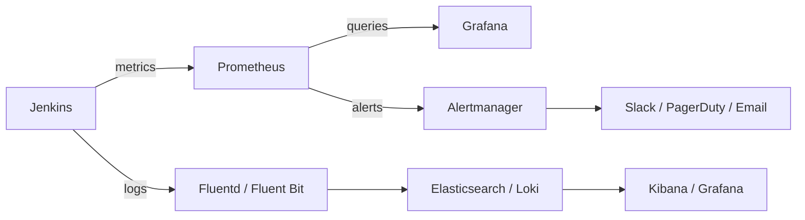

# 13 — Monitoring & Observability

## Overview

A Jenkins instance you cannot observe is a Jenkins instance you cannot trust. This section covers complete observability for Jenkins: Prometheus metrics, Grafana dashboards, log aggregation, alerting, and DORA metrics tracking.

---

## Observability Stack



---

## 1. Prometheus Metrics

### Install Prometheus Metrics Plugin

```properties
# plugins.txt
prometheus:2.5.1
```

### Configuration

```yaml
# JCasC: Prometheus plugin settings
unclassified:
  prometheusConfiguration:
    collectingMetricsPeriodInSeconds: 120
    defaultNamespace: jenkins
    jobAttributeName: jenkins_job
    path: /prometheus
    useAuthenticatedEndpoint: false   # Or true with auth token
    countSuccessfulBuilds: true
    countUnstableBuilds: true
    countFailedBuilds: true
    countNotBuiltBuilds: true
    countAbortedBuilds: true
    fetchTestResults: true
    processDisabledBuilds: false
    appendParamLabel: false
    labeledMetricsScopeConfigList:
    - jobName: null
      labeledMetrics:
      - label: team
        labelValue: ${TEAM_LABEL}
```

### ServiceMonitor for Prometheus Operator

```yaml
# prometheus-service-monitor.yaml
apiVersion: monitoring.coreos.com/v1
kind: ServiceMonitor
metadata:
  name: jenkins
  namespace: monitoring
  labels:
    release: kube-prometheus-stack
spec:
  selector:
    matchLabels:
      app.kubernetes.io/name: jenkins
  namespaceSelector:
    matchNames:
    - jenkins
  endpoints:
  - port: http
    path: /prometheus
    interval: 30s
    scrapeTimeout: 25s
    honorLabels: true
```

---

## 2. Key Jenkins Metrics Reference

### Build Metrics

```promql
# Total builds by job
jenkins_builds_total_builds_total

# Successful builds
jenkins_builds_success_build_count_total

# Failed builds
jenkins_builds_failed_build_count_total

# Unstable builds
jenkins_builds_unstable_build_count_total

# Build failure rate (last 1h)
rate(jenkins_builds_failed_build_count_total[1h]) /
rate(jenkins_builds_total_builds_total[1h]) * 100

# Build duration (95th percentile by job)
histogram_quantile(0.95, 
  rate(jenkins_builds_duration_milliseconds_bucket[10m])
) / 1000  # Convert to seconds
```

### Queue Metrics

```promql
# Current queue length
jenkins_queue_size_value

# Blocked queue items
jenkins_queue_blocked_value

# Buildable queue items
jenkins_queue_buildable_value

# Stuck builds (in queue > 10 min)
jenkins_queue_stuck_value

# Alert: queue length > 20
jenkins_queue_size_value > 20
```

### Executor Metrics

```promql
# Total executor capacity
jenkins_executor_count_value

# Free (idle) executors
jenkins_executor_free_value

# Executor utilization %
(jenkins_executor_count_value - jenkins_executor_free_value) / 
jenkins_executor_count_value * 100

# Alert: utilization > 90% for 10 minutes
(jenkins_executor_count_value - jenkins_executor_free_value) / 
jenkins_executor_count_value * 100 > 90
```

### Node/Agent Metrics

```promql
# Total nodes
jenkins_node_count_value

# Offline nodes
jenkins_node_offline_value

# Online nodes
jenkins_node_online_value

# Alert: any node offline
jenkins_node_offline_value > 0
```

### JVM Metrics

```promql
# Heap usage
jvm_memory_bytes_used{area="heap"} / jvm_memory_bytes_max{area="heap"} * 100

# GC time
rate(jvm_gc_collection_seconds_sum[5m])

# Thread count
jvm_threads_current

# Alert: heap > 80%
jvm_memory_bytes_used{area="heap"} / jvm_memory_bytes_max{area="heap"} * 100 > 80
```

---

## 3. Grafana Dashboard

### Dashboard Configuration

```json
{
  "dashboard": {
    "title": "Jenkins CI/CD Overview",
    "uid": "jenkins-overview",
    "panels": [
      {
        "title": "Build Success Rate",
        "type": "stat",
        "targets": [{
          "expr": "(1 - rate(jenkins_builds_failed_build_count_total[1h]) / rate(jenkins_builds_total_builds_total[1h])) * 100",
          "legendFormat": "Success Rate %"
        }],
        "fieldConfig": {
          "defaults": {
            "unit": "percent",
            "thresholds": {
              "steps": [
                {"color": "red", "value": 0},
                {"color": "yellow", "value": 80},
                {"color": "green", "value": 95}
              ]
            }
          }
        }
      }
    ]
  }
}
```

### Import Pre-Built Dashboards

```bash
# Jenkins performance dashboard (Grafana ID: 9964)
# Import via Grafana UI → Dashboards → Import → ID: 9964

# Jenkins pipeline metrics (Grafana ID: 10033)
# Import via Grafana UI → Dashboards → Import → ID: 10033
```

### Key Dashboard Panels

```text
Row 1: Overview
  - Total Builds Today (counter)
  - Build Success Rate (gauge, %)
  - Mean Build Duration (stat)
  - Active Builds (counter)

Row 2: Queue & Executors
  - Queue Length (time series)
  - Executor Utilization (gauge, %)
  - Blocked Jobs (time series)
  - Agent Status (table)

Row 3: Build Performance
  - Build Duration by Job (histogram)
  - Builds per Hour (time series)
  - Failure Rate by Job (bar chart)
  - Slowest Jobs (table)

Row 4: JVM Health
  - Heap Usage (gauge)
  - GC Time (time series)
  - Thread Count (time series)
  - CPU Usage (gauge)
```

---

## 4. Alerting Rules

### Prometheus Alert Rules

```yaml
# jenkins-alerts.yaml
apiVersion: monitoring.coreos.com/v1
kind: PrometheusRule
metadata:
  name: jenkins-alerts
  namespace: monitoring
  labels:
    release: kube-prometheus-stack
spec:
  groups:
  - name: jenkins.build.alerts
    rules:
    # Build failure rate > 20%
    - alert: JenkinsHighBuildFailureRate
      expr: |
        rate(jenkins_builds_failed_build_count_total[30m]) /
        rate(jenkins_builds_total_builds_total[30m]) * 100 > 20
      for: 10m
      labels:
        severity: warning
        team: platform
      annotations:
        summary: "Jenkins high build failure rate"
        description: "Build failure rate is {{ $value | humanize }}% (threshold: 20%)"
        runbook_url: https://wiki.example.com/runbooks/jenkins-high-failure-rate

    # Zero builds for 2 hours during business hours (possible system issue)
    - alert: JenkinsNoBuildActivity
      expr: |
        increase(jenkins_builds_total_builds_total[2h]) == 0
        and (hour() >= 8 and hour() <= 18)
        and (day_of_week() >= 1 and day_of_week() <= 5)
      for: 5m
      labels:
        severity: warning
        team: platform
      annotations:
        summary: "No Jenkins build activity detected"
        description: "No builds have completed in the last 2 hours during business hours"

  - name: jenkins.queue.alerts
    rules:
    # Queue length too high
    - alert: JenkinsQueueTooLong
      expr: jenkins_queue_size_value > 50
      for: 15m
      labels:
        severity: warning
        team: platform
      annotations:
        summary: "Jenkins build queue is too long"
        description: "Build queue has {{ $value }} items (threshold: 50)"
        runbook_url: https://wiki.example.com/runbooks/jenkins-queue-full

    # Stuck builds
    - alert: JenkinsStuckBuilds
      expr: jenkins_queue_stuck_value > 5
      for: 5m
      labels:
        severity: critical
        team: platform
      annotations:
        summary: "Jenkins has stuck builds"
        description: "{{ $value }} builds are stuck in the queue"

  - name: jenkins.executor.alerts
    rules:
    # Executors saturated
    - alert: JenkinsExecutorsSaturated
      expr: |
        (jenkins_executor_count_value - jenkins_executor_free_value) /
        jenkins_executor_count_value * 100 > 90
      for: 10m
      labels:
        severity: warning
        team: platform
      annotations:
        summary: "Jenkins executors are nearly full"
        description: "Executor utilization is {{ $value | humanize }}%"

  - name: jenkins.agent.alerts
    rules:
    # Agent offline
    - alert: JenkinsAgentOffline
      expr: jenkins_node_offline_value > 0
      for: 5m
      labels:
        severity: warning
        team: platform
      annotations:
        summary: "Jenkins agent is offline"
        description: "{{ $value }} Jenkins agent(s) are offline"

  - name: jenkins.jvm.alerts
    rules:
    # High heap usage
    - alert: JenkinsHighHeapUsage
      expr: |
        jvm_memory_bytes_used{area="heap"} /
        jvm_memory_bytes_max{area="heap"} * 100 > 80
      for: 10m
      labels:
        severity: warning
        team: platform
      annotations:
        summary: "Jenkins JVM heap usage is high"
        description: "Heap usage is {{ $value | humanize }}%"

    # Critical heap usage
    - alert: JenkinsHeapCritical
      expr: |
        jvm_memory_bytes_used{area="heap"} /
        jvm_memory_bytes_max{area="heap"} * 100 > 90
      for: 2m
      labels:
        severity: critical
        team: platform
      annotations:
        summary: "Jenkins JVM heap is critically high — possible OOM"
        description: "Heap usage is {{ $value | humanize }}%. Possible OutOfMemoryError imminent."
```

### Alertmanager Configuration

```yaml
# alertmanager.yaml
global:
  resolve_timeout: 5m

route:
  group_by: ['alertname', 'team']
  group_wait: 30s
  group_interval: 5m
  repeat_interval: 4h
  receiver: 'default'

  routes:
  - match:
      severity: critical
    receiver: pagerduty
    continue: true
  - match:
      severity: warning
      team: platform
    receiver: slack-platform

receivers:
- name: default
  slack_configs:
  - api_url: ${SLACK_WEBHOOK_URL}
    channel: '#devops-alerts'
    title: '{{ .CommonAnnotations.summary }}'
    text: '{{ range .Alerts }}{{ .Annotations.description }}{{ end }}'
    send_resolved: true

- name: slack-platform
  slack_configs:
  - api_url: ${SLACK_WEBHOOK_URL}
    channel: '#platform-alerts'
    title: '[{{ .Status | toUpper }}] {{ .CommonAnnotations.summary }}'
    text: |
      *Alert:* {{ .CommonAnnotations.summary }}
      *Description:* {{ .CommonAnnotations.description }}
      *Severity:* {{ .CommonLabels.severity }}
      *Runbook:* {{ .CommonAnnotations.runbook_url }}
    send_resolved: true

- name: pagerduty
  pagerduty_configs:
  - routing_key: ${PAGERDUTY_ROUTING_KEY}
    description: '{{ .CommonAnnotations.summary }}'
    details:
      alert: '{{ .CommonAnnotations.description }}'
```

---

## 5. Log Management

### Fluentd Configuration (Ship Jenkins Logs to Elasticsearch)

```yaml
# fluentd-configmap.yaml
apiVersion: v1
kind: ConfigMap
metadata:
  name: fluentd-config
  namespace: jenkins
data:
  fluent.conf: |
    <source>
      @type tail
      path /var/jenkins_home/logs/jenkins.log
      pos_file /var/fluentd/jenkins.log.pos
      tag jenkins.system
      <parse>
        @type multiline
        format_firstline /^\d{4}-\d{2}-\d{2}/
        format1 /^(?<time>\d{4}-\d{2}-\d{2} \d{2}:\d{2}:\d{2}.\d+)\s+(?<level>[A-Z]+)\s+(?<class>\S+)\s+(?<message>.*)/
        time_format %Y-%m-%d %H:%M:%S.%L
      </parse>
    </source>

    <source>
      @type tail
      path /var/jenkins_home/audit/*.log
      pos_file /var/fluentd/audit.log.pos
      tag jenkins.audit
      <parse>
        @type none
      </parse>
    </source>

    <filter jenkins.**>
      @type record_transformer
      <record>
        service jenkins
        environment production
        hostname ${hostname}
      </record>
    </filter>

    <match jenkins.**>
      @type elasticsearch
      host elasticsearch.monitoring.svc.cluster.local
      port 9200
      index_name jenkins-logs-%Y.%m.%d
      type_name _doc
      <buffer time>
        flush_interval 5s
        flush_at_shutdown true
      </buffer>
    </match>
```

### Loki + Grafana (Simpler Alternative)

```yaml
# Promtail configuration for Jenkins logs
# promtail-config.yaml
scrapeConfigs:
  - job_name: jenkins-logs
    static_configs:
    - targets:
        - localhost
      labels:
        job: jenkins
        __path__: /var/jenkins_home/logs/*.log

pipeline_stages:
  - multiline:
      firstline: '^\d{4}-\d{2}-\d{2}'
      max_wait_time: 3s
  - regex:
      expression: '^(?P<time>\d{4}-\d{2}-\d{2} \d{2}:\d{2}:\d{2}.\d+)\s+(?P<level>[A-Z]+)\s+(?P<class>\S+)\s+(?P<message>.*)'
  - labels:
      level:
      class:
  - timestamp:
      source: time
      format: '2006-01-02 15:04:05.000'
```

---

## 6. DORA Metrics

The four DORA (DevOps Research and Assessment) metrics measure software delivery performance.

```text
DORA Metrics:
1. Deployment Frequency    — How often do you deploy?
2. Lead Time for Changes   — Time from commit to production
3. Change Failure Rate     — % of deployments causing failures
4. Time to Restore Service — MTTR after incidents
```

### Measuring DORA Metrics via Jenkins

```groovy
// Track deployment events for DORA metrics
stage('Deploy Production') {
    when { branch 'main' }
    steps {
        script {
            def deployStart = System.currentTimeMillis()

            sh './deploy-production.sh'

            def deployEnd = System.currentTimeMillis()
            def deployDuration = (deployEnd - deployStart) / 1000

            // Push deployment event to metrics backend
            // This enables: deployment frequency, lead time tracking
            sh """
                curl -X POST https://metrics.example.com/deployments \
                  -H 'Content-Type: application/json' \
                  -d '{
                    "service": "${APP_NAME}",
                    "version": "${IMAGE_TAG}",
                    "environment": "production",
                    "commit": "${GIT_COMMIT}",
                    "commit_time": "${GIT_COMMIT_TIMESTAMP}",
                    "deploy_time": "${new Date().format("yyyy-MM-dd'T'HH:mm:ss'Z'")}",
                    "deploy_duration_seconds": ${deployDuration},
                    "triggered_by": "${currentBuild.getCauses()[0]?.getUserId() ?: 'automated'}"
                  }'
            """
        }
    }
}
```

### DORA Dashboard Queries

```promql
# Deployment Frequency (deployments per day)
increase(deployment_events_total{environment="production"}[1d])

# Lead Time for Changes (requires commit timestamp tracking)
avg(deployment_lead_time_seconds{environment="production"})

# Change Failure Rate (% of deployments that caused incidents)
increase(incident_events_total{triggered_by="deployment"}[7d]) /
increase(deployment_events_total{environment="production"}[7d]) * 100

# Time to Restore (MTTR)
avg(incident_resolution_time_seconds)
```

---

## 7. Build Performance Optimization with Metrics

### Identifying Slow Stages

```groovy
// Add timing to every stage
def timings = [:]
def stageStart

pipeline {
    agent any

    stages {
        stage('Checkout') {
            steps {
                script { stageStart = System.currentTimeMillis() }
                checkout scm
                script { timings['Checkout'] = System.currentTimeMillis() - stageStart }
            }
        }

        stage('Build') {
            steps {
                script { stageStart = System.currentTimeMillis() }
                sh 'mvn package'
                script { timings['Build'] = System.currentTimeMillis() - stageStart }
            }
        }

        // ... more stages
    }

    post {
        always {
            script {
                // Report timings to Prometheus pushgateway or metrics API
                def total = timings.values().sum()
                timings.each { stage, duration ->
                    sh """
                        echo "jenkins_stage_duration_seconds{job=\"${JOB_NAME}\",stage=\"${stage}\"} ${duration/1000}" | \
                          curl -X POST http://pushgateway.monitoring:9091/metrics/job/${JOB_NAME} \
                          --data-binary @-
                    """
                }
                echo "Stage timings: ${timings}"
                echo "Total build time: ${total/1000}s"
            }
        }
    }
}
```

---

## 8. Health Dashboard

### Jenkins System Health Pipeline

```groovy
// Scheduled health check job — runs every 5 minutes
pipeline {
    agent { label 'linux' }

    triggers {
        cron('H/5 * * * *')
    }

    stages {
        stage('Health Check') {
            steps {
                script {
                    def healthMetrics = [:]

                    // Queue length
                    def queue = sh(
                        script: "curl -s ${JENKINS_URL}/queue/api/json --user ${JENKINS_USER}:${JENKINS_TOKEN} | jq '.items | length'",
                        returnStdout: true
                    ).trim().toInteger()
                    healthMetrics['queue_length'] = queue

                    // Executor utilization
                    def executorData = sh(
                        script: "curl -s ${JENKINS_URL}/computer/api/json --user ${JENKINS_USER}:${JENKINS_TOKEN} | jq '{total: .totalExecutors, busy: .busyExecutors}'",
                        returnStdout: true
                    ).trim()

                    // Push to Prometheus Pushgateway
                    sh """
                        cat <<EOF | curl -X POST http://pushgateway:9091/metrics/job/jenkins-health --data-binary @-
jenkins_health_queue_length ${queue}
EOF
                    """

                    // Alert if thresholds breached
                    if (queue > 50) {
                        slackSend color: 'warning',
                                  message: "⚠️ Jenkins queue length: ${queue}"
                    }
                }
            }
        }
    }
}
```

---

## 9. SLA Tracking

```groovy
// Track SLA compliance per team
// Acceptable build duration by tier:
// - Critical path jobs: < 5 minutes
// - Standard CI jobs: < 15 minutes
// - Full CD pipelines: < 30 minutes

def checkSLA(String tier, long durationSeconds) {
    def limits = [critical: 300, standard: 900, full: 1800]
    def limit = limits[tier] ?: 900

    if (durationSeconds > limit) {
        echo "SLA BREACH: ${JOB_NAME} took ${durationSeconds}s (limit: ${limit}s for tier: ${tier})"
        // Push metric
        sh "echo 'jenkins_sla_breach_total{job=\"${JOB_NAME}\",tier=\"${tier}\"} 1' | curl -X POST..."
    }
}
```

---

## Best Practices

1. **Scrape Jenkins metrics every 30s** — balance freshness vs. load
2. **Use histogram metrics** for build duration — enables percentile analysis
3. **Correlate metrics with deployments** — annotate Grafana when deployments happen
4. **Alert on trends, not just thresholds** — a rising failure rate is worth alerting before it hits the threshold
5. **Track DORA metrics** — they measure what matters to the business
6. **Ship logs to central store** — Elasticsearch or Loki
7. **Create team-level dashboards** — each team should see their own pipeline health
8. **Monitor agent pool size** — scale agents based on queue depth
9. **Set SLA targets** — define and measure acceptable build duration targets
10. **Review metrics weekly** — metrics without review are noise

---

## References

- [Jenkins Prometheus Plugin](https://plugins.jenkins.io/prometheus/)
- [Grafana Dashboard — Jenkins](https://grafana.com/grafana/dashboards/9964)
- [Prometheus AlertManager](https://prometheus.io/docs/alerting/latest/alertmanager/)
- [DORA State of DevOps Report](https://dora.dev/)
- [Fluentd for Kubernetes](https://docs.fluentd.org/container-deployment/kubernetes)
- [Loki + Grafana](https://grafana.com/docs/loki/latest/)

---

## Next Section

[14 — Troubleshooting →](../14-troubleshooting/README.md)
