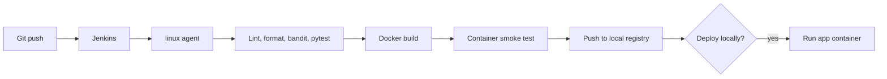

# Project 01 - Python Flask Todo API

This project is the main hands-on application in the repository. It gives learners a small but real API, tests, a Docker image, and multiple Jenkinsfile levels so they can grow from first pipeline to a more complete CI/CD flow.

## Module Summary

| Field | Value |
| --- | --- |
| Level | Beginner-Intermediate |
| Estimated duration | 60-90 minutes |
| Environment | [00-local-lab-setup](../../00-local-lab-setup/README.md) |
| Cost | Free |
| Validation | `./scripts/validate.sh` |
| Cleanup | `./scripts/cleanup.sh` |

## Learning Objectives

- run a practical Jenkins pipeline against a small Python API
- understand checkout, lint, test, image build, smoke test, push, and optional deploy
- compare beginner and intermediate Jenkinsfile designs
- read JUnit and coverage output in Jenkins
- understand why images should be smoke-tested before pushing

## Project Files

```text
15-real-world-projects/01-python-flask-todo-api/
├── README.md
├── app/
├── tests/
├── Dockerfile
├── .dockerignore
├── requirements.txt
├── requirements-dev.txt
├── Jenkinsfile
├── Jenkinsfile.beginner
├── Jenkinsfile.intermediate
├── docker-compose.yml
├── scripts/
│   ├── validate.sh
│   └── cleanup.sh
├── starter/
├── solution/
├── troubleshooting.md
├── learner-challenges.md
└── diagrams/
```

## Pipeline Levels

- `Jenkinsfile.beginner`: checkout, install, test, build
- `Jenkinsfile.intermediate`: adds lint, format, bandit, reports, smoke test, push, and optional deploy
- `Jenkinsfile`: default teaching pipeline, aligned with the intermediate version

## Architecture



Technical explanation:

- code quality and tests run before container packaging
- the image is smoke-tested before it is pushed
- local deployment is optional and controlled by a parameter

Simple explanation:

- Jenkins checks your code first, then builds the image, then proves it starts, then stores it in the registry

## Prerequisites

- local lab running
- Docker configured to trust `localhost:5000` as an insecure registry
- Jenkins job or multibranch pipeline pointed at this repository

## Run It Locally Without Jenkins

```bash
python3 -m venv .venv
source .venv/bin/activate
pip install -r requirements.txt -r requirements-dev.txt
./scripts/validate.sh
docker compose up --build
```

## Jenkins Job Setup

1. Create a Pipeline job in Jenkins.
2. Point SCM to this repository.
3. Choose `Jenkinsfile.beginner` for first-time learners or `Jenkinsfile` for the full flow.
4. Run the job on the `linux` agent from the local lab.

## Expected Output

- flake8, black, and bandit complete
- tests pass and JUnit results appear in Jenkins
- image `localhost:5000/flask-todo-api:<build-number>` is built
- smoke test hits `/health`
- image is pushed to the local registry

## Validation

```bash
./scripts/validate.sh
```

## Guided Exercise

1. Run the beginner pipeline.
2. Break formatting in `app/api.py`.
3. Run the intermediate pipeline and observe the failure.
4. Fix the issue and rerun.

## Independent Challenge

See [learner-challenges.md](./learner-challenges.md).

## Troubleshooting

See [troubleshooting.md](./troubleshooting.md).

## Cleanup

```bash
./scripts/cleanup.sh
docker compose down --remove-orphans
```

## Interview Questions

Use [../../learner-resources/interview-questions.md](../../learner-resources/interview-questions.md) and focus on controller-agent, test reporting, Docker socket risk, and registry workflows.
