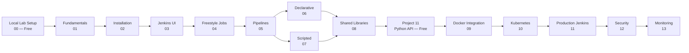

# Ultimate Jenkins DevOps

> A structured, production-grade Jenkins learning path — from first installation to enterprise CI/CD architecture. Every concept includes working code, architecture diagrams, and real-world context.

---

## Quick Start

| Your Level | Start Here |
|---|---|
| Absolute beginner — set up a free local lab | [00 — Local Lab Setup](./00-local-lab-setup/) |
| New to Jenkins — learn the theory | [01 — Fundamentals](./01-fundamentals/) |
| First real project — free, runs on your laptop | [Project 11 — Python Flask API](./15-real-world-projects/11-python-flask-todo-api/) |
| Know the basics, want pipelines | [05 — Pipelines](./05-pipelines/) |
| Building production systems | [11 — Production-Grade Jenkins](./11-production-grade-jenkins/) |

> **No cloud account? No problem.** The [local lab](./00-local-lab-setup/) and [Project 11](./15-real-world-projects/11-python-flask-todo-api/) give you a complete CI/CD environment using only Docker — free, entirely on your laptop.

---

## Learning Path



---

## Modules

| # | Module | Level | Cost | Topics |
|---|---|---|---|---|
| 00 | [Local Lab Setup](./00-local-lab-setup/) | Beginner | **Free** | Jenkins + Gitea + local Registry in Docker |
| 01 | [Fundamentals](./01-fundamentals/) | Beginner | Free | Jenkins architecture, CI/CD concepts, how it works |
| 02 | [Installation](./02-installation/) | Beginner | Free | Docker, bare metal, Kubernetes Helm installs |
| 03 | [Jenkins UI](./03-jenkins-ui/) | Beginner | Dashboards, plugins, system configuration |
| 04 | [Freestyle Jobs](./04-freestyle-jobs/) | Beginner | Free | Build triggers, SCM integration, build steps |
| 05 | [Pipelines](./05-pipelines/) | Beginner–Intermediate | Free | Pipeline concepts, stages, agents, post actions |
| 06 | [Declarative Pipelines](./06-declarative-pipelines/) | Intermediate | Free | Full declarative syntax, parameters, when conditions |
| 07 | [Scripted Pipelines](./07-scripted-pipelines/) | Intermediate | Free | Groovy DSL, dynamic logic, custom control flow |
| 08 | [Shared Libraries](./08-shared-libraries/) | Intermediate | Free | DRY pipelines, vars, src, resources structure |
| 09 | [Docker Integration](./09-docker-integration/) | Intermediate | Free | Docker agents, image builds, registry workflows |
| 10 | [Kubernetes Integration](./10-kubernetes-integration/) | Advanced | Free (Minikube) | Dynamic pod agents, namespaces, RBAC |
| 11 | [Production-Grade Jenkins](./11-production-grade-jenkins/) | Advanced | Cloud | HA, JCasC, backup, scaling, Helm deployment |
| 12 | [Security](./12-security/) | Advanced | Free | RBAC, secrets management, audit logging, HTTPS |
| 13 | [Monitoring](./13-monitoring/) | Advanced | Free | Prometheus metrics, Grafana dashboards, alerting |
| 14 | [Troubleshooting](./14-troubleshooting/) | All levels | Free | Common failures, log analysis, plugin conflicts |
| 15 | [Real-World Projects](./15-real-world-projects/) | All levels | Mixed | End-to-end CI/CD pipelines for real applications |
| 16 | [Interview Questions](./16-interview-questions/) | All levels | Free | Concept questions, scenario walkthroughs, answers |
| 17 | [Official References](./17-official-references/) | Reference | Free | Curated links to Jenkins, Docker, and K8s docs |

---

## What You Will Build

**Free (no cloud account needed):**
- A complete local CI/CD lab — Jenkins, Gitea, and a Docker registry running on your laptop
- CI/CD pipeline for a Python Flask API (lint → test → security scan → Docker build → push)

**With cloud access:**
- CI/CD pipeline for a Java application (build → test → scan → deploy)
- Dockerized Jenkins with dynamic build agents
- Multi-branch pipelines with GitHub webhook triggers
- Shared libraries for reusable pipeline logic
- Blue-green and canary deployments on Kubernetes
- Production Jenkins on Kubernetes with Helm, JCasC, and Velero backups
- Infrastructure provisioning pipelines with Terraform

---

## Prerequisites

| Topic | Required |
|---|---|
| Linux command line | Required |
| Git basics | Required |
| Basic networking (ports, DNS) | Required |
| Docker basics | Helpful |
| Kubernetes basics | For modules 10–11 only |

---

## Learning Approach

Each module follows the same structure:

```
Concept → Architecture Diagram → Step-by-Step Lab → Validation → Troubleshooting → Best Practices
```

No toy examples. Every lab reflects a real-world pattern used in production.

---

## Technologies

Jenkins · Git · GitHub · Docker · Kubernetes · Helm · Terraform · Ansible · SonarQube · Nexus · Prometheus · Grafana · Bash

---

## Show Your Support

If this repository helps you learn Jenkins or level up your DevOps skills, please consider:

- **Star this repo** — it helps others discover it and keeps me motivated to add more content
- **Fork it** — make it your own learning sandbox or build on top of it
- **Share it** — send it to a colleague, post it in your team's Slack, or mention it in a blog post

Every star and fork genuinely makes a difference. Thank you.

[](https://github.com/cloud-prakhar/ultimate-jenkins-devops/stargazers)
[](https://github.com/cloud-prakhar/ultimate-jenkins-devops/network/members)

---

> "Automation is not replacing engineers. It is replacing repetitive work."
