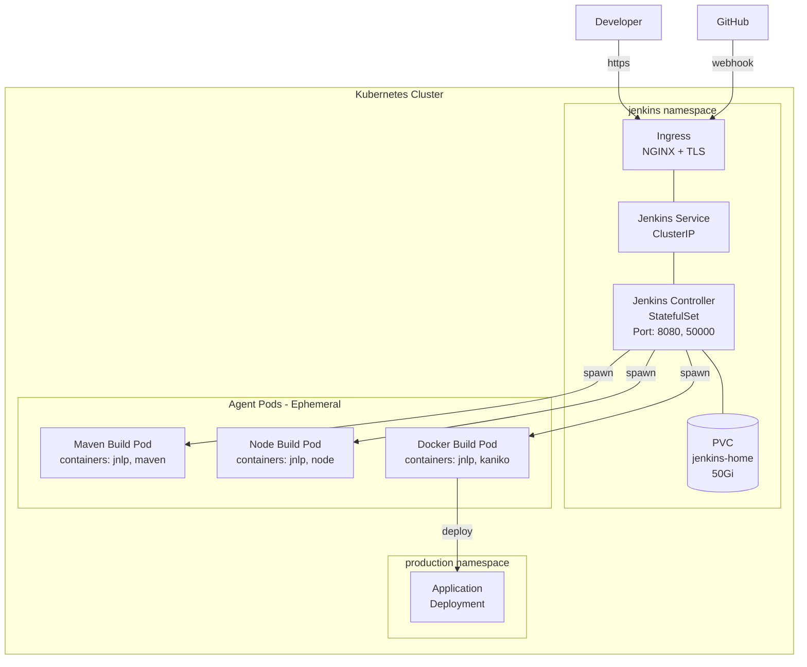
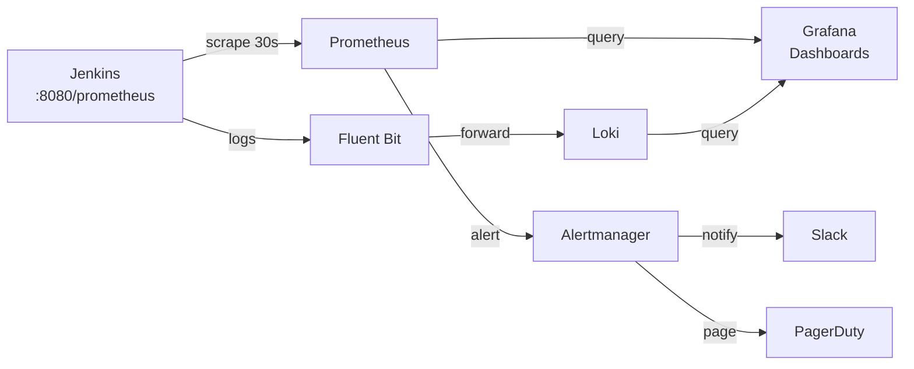

# Architecture Diagrams

This folder contains architecture diagrams for the repository. All diagrams are in Mermaid format (rendered by GitHub) or ASCII format.

---

## Jenkins Core Architecture

```
┌─────────────────────────────────────────────────────────────────────────────┐
│                          JENKINS PRODUCTION ARCHITECTURE                    │
│                                                                             │
│   Developer                                                                 │
│      │                                                                      │
│      │  git push                                                            │
│      ▼                                                                      │
│   ┌──────────┐      webhook      ┌─────────────────────────────────────┐   │
│   │  GitHub  │─────────────────▶ │         JENKINS CONTROLLER          │   │
│   │  GitLab  │                   │                                     │   │
│   └──────────┘                   │  ┌───────────┐  ┌───────────────┐  │   │
│                                  │  │ Job Config│  │  Build Queue  │  │   │
│   ┌──────────┐                   │  └───────────┘  └───────────────┘  │   │
│   │  Slack   │◀── notifications ─│  ┌───────────┐  ┌───────────────┐  │   │
│   │  Email   │                   │  │Credentials│  │Pipeline Engine│  │   │
│   └──────────┘                   │  └───────────┘  └───────────────┘  │   │
│                                  │                                     │   │
│                                  │  JENKINS_HOME (PVC - 50Gi)         │   │
│                                  └──────────────┬──────────────────────┘   │
│                                                 │                          │
│                             ┌───────────────────┼─────────────────────┐   │
│                             │                   │                     │   │
│                             ▼                   ▼                     ▼   │
│                    ┌─────────────┐   ┌─────────────┐   ┌─────────────┐   │
│                    │ K8s Agent   │   │ K8s Agent   │   │ K8s Agent   │   │
│                    │  (maven)    │   │  (nodejs)   │   │  (docker)   │   │
│                    │  Pod #1     │   │  Pod #2     │   │  Pod #3     │   │
│                    └──────┬──────┘   └──────┬──────┘   └──────┬──────┘   │
│                           │                 │                 │           │
│                   Ephemeral pods — deleted after build completes          │
│                                                                             │
│   ┌─────────────────────────────────────────────────────────────────────┐  │
│   │                     DEPLOYMENT TARGETS                              │  │
│   │                                                                     │  │
│   │  ┌───────────┐   ┌───────────┐   ┌──────────────────────────────┐  │  │
│   │  │    Dev    │   │  Staging  │   │        Production            │  │  │
│   │  │ Namespace │   │ Namespace │   │  (Manual Approval Required)  │  │  │
│   │  └───────────┘   └───────────┘   └──────────────────────────────┘  │  │
│   └─────────────────────────────────────────────────────────────────────┘  │
└─────────────────────────────────────────────────────────────────────────────┘
```

---

## CI/CD Pipeline Flow

```mermaid
flowchart LR
    DEV[Developer] -->|git push| GH[GitHub/GitLab]
    GH -->|webhook| JEN[Jenkins Controller]
    JEN -->|spawn pod| AGENT[K8s Agent Pod]

    AGENT --> CHECKOUT[Checkout]
    CHECKOUT --> BUILD[Build]
    BUILD --> TEST[Unit Tests]
    TEST --> QUALITY[Code Quality\nSonarQube]
    QUALITY --> PACKAGE[Package\nDocker Build]
    PACKAGE --> SCAN[Security Scan\nTrivy]
    SCAN --> PUSH[Push to Registry]
    PUSH --> DEV_DEPLOY[Deploy Dev]
    DEV_DEPLOY --> STAGING[Deploy Staging]
    STAGING --> APPROVAL{Manual\nApproval}
    APPROVAL -->|approved| PROD[Deploy Production]
    APPROVAL -->|rejected| FAIL[Pipeline Ends]
    PROD --> SMOKE[Smoke Tests]
    SMOKE --> NOTIFY[Slack/Email\nNotification]

    style PROD fill:#f96,stroke:#f00
    style APPROVAL fill:#ff9,stroke:#f90
    style SMOKE fill:#9f9,stroke:#0a0
```



---

## Blue-Green Deployment

```
Traffic: 100% → BLUE (current production)
                                              Registry
         ┌──────────────────────┐            ┌────────────────┐
         │   Load Balancer      │            │  myapp:v2.0    │ ← new image
         │   (Kubernetes Svc)   │            └────────────────┘
         └────────┬─────────────┘
                  │                                │
    ┌─────────────▼──────────┐       ┌────────────▼────────────┐
    │      BLUE (v1.0)       │       │      GREEN (v2.0)       │
    │   (currently active)   │       │    (new deployment)     │
    │                        │       │                         │
    │  replicas: 3           │       │  replicas: 3            │
    │  status: ✅ healthy   │       │  status: ✅ healthy    │
    └────────────────────────┘       └─────────────────────────┘

Step 1: Deploy GREEN (new version)
Step 2: Run smoke tests on GREEN
Step 3: Switch LoadBalancer selector: blue → green
Step 4: Monitor error rate for 10 minutes
Step 5: If healthy: scale down BLUE
        If errors: switch back to BLUE (automatic rollback)
```

---

## Jenkins on Kubernetes



---

## Security Layers

```
┌─────────────────────────────────────────────────────────────────────┐
│                    JENKINS SECURITY LAYERS                          │
│                                                                     │
│  Layer 1: Network                                                   │
│    ├── HTTPS only (TLS 1.2+)                                       │
│    ├── VPN-only access                                              │
│    ├── IP allowlisting for webhooks                                 │
│    └── Kubernetes Network Policies                                  │
│                                                                     │
│  Layer 2: Authentication                                            │
│    ├── LDAP / Active Directory                                      │
│    ├── SAML SSO                                                     │
│    └── MFA enforcement                                              │
│                                                                     │
│  Layer 3: Authorization                                             │
│    ├── Role-Based Access Control (RBAC)                             │
│    ├── Principle of Least Privilege                                 │
│    └── Team-scoped folder permissions                               │
│                                                                     │
│  Layer 4: Credential Management                                     │
│    ├── Jenkins Credentials Store (encrypted)                        │
│    ├── HashiCorp Vault (dynamic secrets)                            │
│    └── Automatic masking in build logs                              │
│                                                                     │
│  Layer 5: Pipeline Security                                         │
│    ├── Groovy Sandbox                                               │
│    ├── Script Approval                                              │
│    └── Input validation                                             │
│                                                                     │
│  Layer 6: Container Security                                        │
│    ├── Non-root containers                                          │
│    ├── Read-only root filesystem                                    │
│    ├── No privilege escalation                                      │
│    └── Image vulnerability scanning (Trivy)                         │
│                                                                     │
│  Layer 7: Audit & Compliance                                        │
│    ├── Audit Trail plugin                                           │
│    ├── Centralized log shipping                                     │
│    └── SIEM integration                                             │
└─────────────────────────────────────────────────────────────────────┘
```

---

## Monitoring Architecture



---

## DORA Metrics Tracking

```
DORA Metric          | Target (Elite) | How We Measure
─────────────────────┼────────────────┼─────────────────────────────────────
Deployment Frequency │ On demand      │ Count deploys to production per day
Lead Time            │ < 1 hour       │ Time from commit to production deploy
Change Failure Rate  │ 0-15%          │ % of deploys that cause incidents
Time to Restore      │ < 1 hour       │ Time from incident start to resolution

Jenkins Pipeline contribution:
  ✅ Automates deployments → increases frequency
  ✅ Fast pipelines → reduces lead time
  ✅ Quality gates → reduces failure rate
  ✅ Automated rollback → reduces restore time
```
